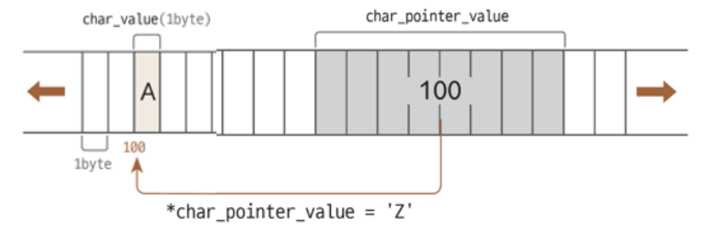

# C/C++ 프로그램 구성

### 기본적인 구성에 있어서 C와 C++ 비교
#### 공통
- `#include`사용 : 헤더파일 첨부

- 변수와 변수 선언 : 변수 타입과 선언 방법 동일
- 함수 구성 및 함수 호출 : 함수 작성과 호출 방법 동일
- `main()` 함수 : 프로그램 실행 시작 원형 동일
- 연산자 : 그대로 수용
- 전역/지역 변수 동일

#### 차이
- 한 줄짜리 주석문 `//` 추가(?)

- 표준 입출력 헤더 파일 `<stdio.h>` → `<iostream>`
    - 2003 부터 헤더 파일에 .h 사용하지 않음
- 표준 입출력 방법 : C 표준입력함수 `scanf/printf` → `cin/cout` 추가

#### C++ 데이터 타임 : bool 추가
- void, char, short int, long, float, double, bool
- bool 타입 상수 `true, false` 사용 가능

## 예제 기본 C++ 프로그램
```cpp
#include <iostream>
using namespace std;

int g=20; /* 전역 변수 */

int add(int x, int y) { // 전역 함수
	return x + y; // x와 y의 합 리턴
}

int main() {
	int a, b, sum; // 지역 변수
	cout << "두 정수를 입력하세요 >>"; // 프롬프트 출력
	cin >> a >> b; // 두 정수를 읽어 a와 b에 입력
	sum = a + b;
	cout << "합은 " << sum << "\n"; // sum 값 출력
	cout << "합은 " << add(a, b) << "\n"; // add() 함수 호출 결과 출력
	cout << "전역 변수 g 값은 " << g; // g 값 출력

	return 0; // return 문을 생략하면 자동으로 return 0;이 삽입된다.
}
```
<br>

# C/C++ 연산자: 수식과 연산자

### 표현식 
- C++ 언어의 소스 코드는 수 많은 표현식과 조건문의 조합
- 연산자, 피연산자(식별자, 리터럴)와 같은 요소로 구성된 구문 또는 식
- 조건문 : `if, while` 등 특정 조건을 만족할 경우 진행/반복이 결정되는 구문 또는 식
- 일반적으로 상수, 단항, 이항, 삼항 연산자 표현식 등으로 구분

### 상수 표현식
- 상수(리터럴)로만 이루어진 표현식
    - 1, 12.345, 'A' 처럼 수식에서 변하지 않는 값

### 단항 연산자 표현식
- 연산자와 피연산자가 일대일로 매칭되는 표현식
    - 연산에 참여하는 피연산자가 하나인 표현식
    - 형 변환을 포함해 부호 변경, 증감 연산자 등이 해당됨
    

- 증감 연산자
    - 피연산자의 증감 단위를 하나씩 증가하거나 감소
        - Int :1, float/double : 1.0, char : 1 ASCII pointer (post,pre)

- 전위/후위 연산
    - __증감 연산자 위치에 따라 값 변경 시점이 다름__
    - 전위 연산 : 다른 연산 수행 전 증감
    - 후위 연산 : 다른 연산 수행 후 증감
    

### 단항 연산자 표현식

#### 논리 NOT(!)
- true → false, false → true 반전
- **C++ 언어에서 false는 0 이외에는 모두 true 취급**
    - 5는 true !5는 false

#### 비트 연산자 NOT(~)
- 비트열 반전, 각 자릿수의 비트값을 1의 보수로 변환
    - 0 → 1, 1 → 0

#### 2의 보수를 구하는 방법
- 1의 보수에 이진수 1을 더함, 양수를 음수로 변환할 때 사용


### 이항 연산자 표현식
- `(피연산자)(연산자)(피연산자)` 피연산자가 두 개인 표현식


+ 논리 연산자
    + 두 개의 피연산자를 참인지 거짓인지 판별 
    + AND(&) : 모두 1이거나 0일 때 참
    + OR(|) : 하나라도 1일 때 참
    + XOR(^) : 피연산자들의 동일 비트를 비교해, 하나만 1일 때 참

- **논리** 시프트 연산 (<<,>>)
    - (>>) : 비트들이 주어진 숫자만큼 오른쪽으로 이동, 가장 오른쪽 비트는 버려짐. 첫 번째 비트는 0으로 채움
    - (<<) : 비트들이 주어진 숫자만큼 왼쪽으로 이동, 가장 왼쪽 비트는 버려짐. 마지막 비트는 0으로 채움
    <br>


- **산술** 시프트 연산 (<<,>>)
    - 오른쪽 시프트 >>
        - 논리와 동일
        - 이동후 비어있는 첫 번째 비트는 이전 값으로 새로 채움
        - signed 데이터 형식에 시프트 연산 실행하면 산술 시프트 연산이 실행

    - 왼쪽 시프트 <<
        - 비트들이 주어진 숫자만큼 왼쪽으로 이동
        - 왼쪽 비트는 버려지고 비어있는 마지막 비트는 0으로 채움
        

### 삼항 연산자 표현식
피연산자가 3개인 유일한 표현식
<br>
if else를 간단하게 표현가능하다.
- 무분별하게 많이 사용하면 가독성이 떨어짐
- 가독성을 해치지 않은 범위 내에서 적절히 사용


<br>

# 조건문
C++는 C언어의 다음 2 가지 유형의 조건문 그대로 사용 : if, if-else if-elseif-else, switch

### if-else 문
#### 선택 구조 (if-else문)
- if-else 문장은 주어진 조건이 참이냐 거짓이냐에 따라서 서로 다른 문장을 실행

### 중첩 if-else문
- 연속적인 if-else문으로 여러 조건을 검사하고 각 조건에 대해 서로 다른 코드를 실행
- C++ 에서는 다음과 같이 if-else문장 안에서 변수 선언도 가능
    - `get_status()`의 반환값이 `condition` 변수에 저장되고 이 값이 참이면 블록이 실행됨
    ```cpp
    if(int condition = get_status(){...})
    ```
### Switch 구문
#### 선택 구조 (switch 문)
- 여러 개의 가능한 실행 경로 중에서 하나를 선택하는 데 사용
- case절과 비교하여 일치하면 break문에 도달할 때까지 실행
- 일치하는 case절이 없으면 default 절 실행
```cpp
switch(value) {
    case 0 :
        cout << "zero\n";
        break;
    case 1 :
        cout << "one\n";
        break;
    default:
        cout << "many\n";
}
```

# 반복문
C++는 C언어의 다음 3가지 반복문을 그대로 사용
- for, while, do-while
- break : 반복문을 벗어남
- continue : 다음 반복을 실행

### for 루프
#### 반복 구조 (for 문)
일정한 횟수만큼 반복할 때 유용하게 사용
```cpp
for (초기식; 조건식; 증감식){
    문장
}
```
예제 : 팩토리얼 값을 구하는 프로그램
```cpp
#include <iostream>
using namespace std;

int main()
{
	long fact = 1;
	int n;

	cout << "정수를 입력하시요:";
	cin >> n;

	for (int i = 1; i <= n; i++)
		fact = fact * i;

	cout << n << "!은 " << fact << "입니다.\n";

	return 0;
}
````
for문 예제
```cpp
#include <iostream>
using namespace std;

int main() {
	int i, a, b, sum=0;
	cout << "두 개의 정수 입력>>";
	cin >> a >> b;

	for(i=a; i<=b; i++) { // a에서 b까지 합 계산
		sum += i;
	}

	cout << a << "에서 " << b << "까지 합은 " << sum;
}
```

### while 루프
#### 반복 구조 (while 문)
같은 처리 과정을 여러 번 되풀이하는 반복 구조에서 while루프는 조건이 만족되면 반복을 계속 실행 함
```cpp
while(조건식){
    문장
}
// 조건식이 거짓일 경우 중단
```
예제 구구단을 while문으로 구현
```cpp
#include <iostream>
using namespace std;

int main()
{
	int n;
	int i = 1;

	cout << "구구단 중에서 출력하고 싶은 단을 입력하시오: ";
	cin >> n;
	while (i <= 9) {
		cout << n << "*" << i << "=" << n * i << endl;
		i++;
	}
	return 0;
}
```

### do-while 루프
#### 반복 구조 (do-while문)
while문과 유사하지만 먼저 문장을 실행하고 조건을 나중에 검사한다.
```cpp
do{
    cout << "종료할까요?";
    getline(cin,str) // 사용자로부터 한 줄의 텍스트를 받을 때 사용하는 함수
}while(str != "예");
```

##### while 예제
```cpp
#include <iostream>
using namespace std;

int main() {
	int i, a, b, sum=0;
	cout << "두 개의 정수 입력>>";
	cin >> a >> b;

	i=a;
	while(i<=b) { // i가 b보다 작거나 같은 동안 반복
		sum += i;
		i++;
	}

	cout << a << "에서 " << b << "까지 합은 " << sum;
}
```

##### do-while 예제
```cpp
#include <iostream>
using namespace std;

int main() {
	int i, a, b, sum=0;
	cout << "두 개의 정수 입력>>";
	cin >> a >> b;

	i=a;
	do {
		sum += i;
		i++;
	} while(i<=b); // i가 b보다 작거나 같은 동안 반복

	cout << a << "에서 " << b << "까지 합은 " << sum;
}
```

### 반복구조 
#### for, while, do-while
- **for문** : 반복 횟수를 미리 알 수 있고 배열을 순회, 특정 범위의 값에 연속해서 접근할 때 유용

- **while 문** : 반복 횟수를 미리 알 수 없고, 특정 조건이 충족되는 한 계속 반복해야할 때 유용

진입 제어 반복문(for, while)과 종료제어 반복문(do-while)이 있다.

#### break문
반복 루프를 벗어나기 위하여 사용
- 반복 루프 안에서 break문이 실행되면 반복 루프는 즉시 중단, 반복 루프 다음에 있는 문장이 실행된다.

#### continue 문
현재 수행하고 있는 반복 과정의 나머지를 건너뛰고 다음 반복과정을 강제적으로 시작하게 만듦
- 반복 루프에서 continue문을 만나게 되면 다음에 있는 후속 코드들은 실행되지 않고 건너뛰게 됨
<br>

##### 예제 : break문을 이용한 반복 루프 벗어남
```cpp
#include <iostream>
using namespace std;

int main()
{
	for (int i = 1; i < 10; i++)
	{
		cout << i << " ";
		if (i == 4)
			break;
	}
	return 0;
}
```

##### 예제 continue문을 이용한 반복 루프 skip
```cpp
#include <iostream>  
using namespace std;

int main()
{
	int i = 0;
	do {
		i++;
		cout << "continue 문장 전에 있는 문장" << endl;
		continue;
		cout << "continue 문장 후에 있는 문장" << endl;
	} while (i < 3);
	return 0;
} 
```

##### 예제 continue와 break문
```cpp
#include <iostream>
using namespace std;

int main() {
	int a;
	while(true) {
		cout << "정수 입력>>";
		cin >> a;
		if(a == 0)
			break; // 0이 입력되면 while 문을 벗어남
		if(a%3 != 0) {
			cout << "No" << "\n"; 
			continue; // 다음 반복. while 문으로 분기
		}
		cout << "Yes" << "\n"; // 입력된 3의 배수 출력
	}
}
```
<br><br>

# 배열
> 동일 타입의 데이터를 하나의 단위로 다루기 위해 연결된 메모리 <br>
C++는 C 언어의 배열 그대로 사용<br>
### 배열 선언
```cpp
int n[10]; // 정수 10개짜리 빈 공간
double d[] = {0.1, 0.2, 0.5, 3.9}
/*d의 크기는 자동으로 3으로 설정
배열 d에 순서대로 0.1, 0.2, 0.5, 3.9 로 초기화*/
```
<br>


`n[10] = 20` : 인덱스 10의 사용 오류. 인덱스는 0~9까지 사용 가능.<br>
`d[-1] = 9.9`: 인덱스 -1 사용 오류. 인덱스는 음수 사용 불가

>같은 종류의 데이터들이 순차적으로 메모리에 저장되는 자료구조 <br> 
각각의 데이터들은 `인덱스`를 사용하여 독립적으로 접근 가능<br>
대용량의 데이터를 동일한 이름으로 쉽게 저장하고 처리 가능

- 배열의 요소에는 번호가 붙어 있는데 이것을 `index`라고 함
- 배열의 `index`는 항상 0부터 시작
- 배열의 인덱스 값이 배열의 크기를 벗어나면 치명적인 오류를 발생시킴
<br>
`scores`라는 이름으로 `int`형으로 크기가 `10`개인 배열을 선언한 예
```cpp
int x = scores[5];
scores[5] = 80;
```
배열의 크기를 `const` 지시자로 기호 상수로 지정하면 배열의 크기를 변경하기 쉬워짐 (`#define`을 사용해도 됨)
```cpp
const int STUDENTS = 10;
// #define STUDENTS =10;
int scores[STUDENTS];
```

##### 배열을 사용하여 평균을 구하는 프로그램
```cpp
#include <iostream>
using namespace std;

int main() {
	const int STUDENTS = 10;
	int scores[STUDENTS];
	int sum = 0;
	int i, average;

	for (i = 0; i < STUDENTS; i++)	{
		cout << "학생들의 성적을 입력하시오: ";
		cin >> scores[i];
	}
	for (i = 0; i < STUDENTS; i++)
		sum += scores[i];

	average = sum / STUDENTS;
	cout << "성적 평균= " << average << endl;
	return 0;
}
```
### 배열의 초기화
콤마로 분리된 초기 값들의 리스트 대입


초기값의 개수가 요소들의 개수보다 적은 경우에는 앞에 있는 요소들만 초기화된 값, 나머지 배열의 요소들을 0으로 초기화 됨


배열의 크기가 비어있고 초기값의 리스트만 있는 경우에는 컴파일러가 자동으로 초기값들의 개수만큼 배열 크기를 설정함


> 배열을 초기화 하지 않는 경우
- 함수 외부에 정의된 배열은 자동으로 `0`으로 초기화됨 <br>
- 함수 내부에 정의된 배열은 쓰레기 값을 가지므로 주의

### 보편적 초기화
`C++11`, `C++14`에서의 보편적 초기화
- 변수의 초기값 사이에 등호(=)가 없어도 됨
- 모든 초기화에 중괄호 {}을 사용가능
```cpp
int scores[] = {10,20,30};
int scores[] {10,20,30};
```
- 일반 변수 초기화, 문자열 초기화, 객체 초기화에도 사용 가능
```cpp
int a{0};                   //int a = 0;
string s{"hello"}           //string s = "hello";
vector<string> list{"alpha","beta","gamma"} //벡터 생성시 초기화
```
##### 예제 배열 선언 및 활용
```cpp
#include <iostream>
using namespace std;

int main() {
	int n[10]; // 정수 10개짜리 빈 메모리 공간
	double d[] = {0.1, 0.2, 0.5, 3.9}; // 배열 d에 0.1, 0.2, 0.5, 3.9로 초기화

	int i;
	for(i=0; i<10; i++) n[i] = i*2; // 2의 배수로 n에 값을 채움
	for(i=0; i<10; i++) cout << n[i] << ' '; // 배열 n 출력
	cout << "\n"; // 한 줄 띈다.

	double sum = 0; // C++에서는 필요할 때 변수를 아무 곳이나 선언 가능
	for(i=0; i<4; i++) { // 배열 d의 합 계산
		sum += d[i];
	}

	cout << "배열 d의 합은 " << sum; // 배열 d의 합 출력
}
```

### 다차원 배열
> 배열의 배열(arrays of arrays)로 불림<br>
> 2차원 배열 : 배열 요소들이 2차원으로 나열된 배열


`int m[2][5];` 2행 5열의 2차원 배열 선언

`m[2][0] = 5;` 오류, 인덱스 2가 잘못 사용됨<br>
`m[0][6] = 2;` erroe, 인덱스 6이 잘못 사용됨

#### 2차원 배열의 선언
> 행과 열을 나타내는 2개의 인덱스를 가짐
>> 행(`row`)과 열(`column`)로 본다면, 배열 s는 3개의 행과 각 행에는 5개의 요소가 있다고 할 수 있다.<br>
>>`s[0][0],s[0][1],s[0][2],...,s[2][3],s[2][4]`까지의 모두 15개 요소를 가짐

#### 초기화
2차원 배열도 1차원과 마찬가지로 선언과 동시에 초기화 가능<br>
같은 행에 속하는 초기값들을 중괄호 {}로 따로 묶어줘야한다.

##### 구구단 표의 일부(1,2,3단) 저장
```cpp
#include <iostream>
using namespace std;

#define WIDTH 9
#define HEIGHT 3

int main() {
	int table[HEIGHT][WIDTH];
	int r, c;

	for (r = 0; r < HEIGHT; r++)
		for (c = 0; c < WIDTH; c++)
			table[r][c] = (r + 1)*(c + 1);

	for (r = 0; r < HEIGHT; r++) {
		for (c = 0; c < WIDTH; c++) {
			cout << table[r][c] << ", ";
		}
		cout << endl;
	}
}
```

# 함수
> 매개 변수를 통해 데이터를 전달받아 처리한 후 결과를 리턴하는 코드블록<br>
> C++는 C언어의 함수 기법 그대로 계승
- 특정 작업을 수행하여 그 결과를 반환하는 블랙박스와 같은 것
- 특정 작업을 수행하는 코드 집합 : `프로시져`
- 함수를 사용하면 코드의 재활용 가능, 가독성 증대, 유지관리 용이 등의 많은 장점이 있음


<br>

- `반환 형식` : 함수가 반환할 값의 자료형
    - 없을 땐 `void`로 표기
- `함수 이름` : 함수 호출할 때 사용할 이름
    - 문자나 밑줄(_)로 시작, 숫자나 공백으로 시작할 수 없음
- `매개 변수` : 함수가 호출될 때 전달받은 값을 저장하는 변수
    - 지역 변수 전달받을 값이 없을 땐 비워두거나, `void`로 매개 변수가 없음을 표기
- `함수 몸체` : 함수의 기능을 정의하는 부분

### 함수 호출
> 함수를 정의하는 목적은 함수를 사용하기 위함이다.<br> 함수 이름을 써주고 함수가 필요로 하는 데이터를 나열


##### adder() 함수와 호출
```cpp
#include <iostream>
using namespace std;

// 두 개의 정수를 받아 합을 구하고 결과를 리턴하는 함수 adder
int adder(int a, int b) {
	int sum;
	sum = a + b;
	return sum;
}

int main() {
	int n = adder(24567, 98374); // 함수 adder() 호출
	cout << "24567과 98374의 합은 " << n << "입니다\n";

	int a, b;
	cout << "두 개의 정수를 입력하세요>>";
	cin >> a >> b;
	n = adder(a, b); // 함수 adder() 호출
	cout << a << "와 " << b << "의 합은 " << n << "입니다\n";
}
```


##### 예제 함수 호출
``` cpp
#include <iostream>
using namespace std;

// 두 개의 정수를 받아 큰 값을 리턴하는 함수
int bigger(int a, int b) {
	if(a>b) return a;
	else return b;
}
// 매개 변수가 3으로 나누어지면 true, 아니면 false를 리턴하는 함수
bool dividedBy3(int n) {
	if(n%3 == 0) return true;
	else return false;
}

int main() {
	int a, b, n;
	cout << "두 개의 정수 입력>>";
	cin >> a >> b;
							 // (1) 함수 bigger() 호출
	cout << a << "중 " << b << "중 큰 값은 " << n << "입니다.\n";

							 // (2) n이 3의 배수이면
		cout << n << "은 " << "3의 배수입니다.\n";
	else
		cout << n << "은 " << "3의 배수가 아닙니다.\n";
}
```
##### 큰 값을 리턴하는 함수를 정의하고 호출하여 출력
```cpp

#include <iostream>
using namespace std;

// 함수 정의
int max(int x, int y)
{
	if (x>y)
		return x;
	else
		return y;
}

int main()
{
	int n;
	n = max(2, 3);	// 함수 호출
	cout << "연산 결과 = " << n << endl;
	return 0;
}
```

### Lab: 함수 만들기
입력받은 정수값을 제곱하여 리턴하는 함수를 정의/호출하여 정수의 제곱값을 출력하는 함수를 만들어 보자
##### 예제
```cpp
#include <iostream>
using namespace std;

int square(int n)
{
	return(n*n);
}

int main()
{
	int n;
	cout << "제곱할 정수를 입력하시오: ";
	cin >> n;

	cout << square(n) << endl;
	return 0;
}
``` 

# 함수 원형 정의

### 함수 원형, 함수 프로토타입이란
```
변수 선언처럼, 함수의 형식만 선언한 것
세미콜론으로 끝맺음;
예 ) __intadder(int a,int b); // adder()함수의 원형
``` 
### 함수의 원형을 선언하는 이유
함수 이름, 매개 변수 타입과 개수, 리턴 타입을 컴파일러에게 알려주어 함수 호출 문장이 정확한지 판단하게 도움

### 함수 원형
함수를 사용할 때에는 미리 컴파일러에게 함수에 대한 정보를 알려야함<br>
함수의 이름, 매개 변수, 반환형을 정의
```cpp
int squre(int n);
```

<br><br>

# 함수의 매개 변수 사용
### 함수의 매개 변수
> 변수, 포인터 및 배열 등 다양한 값을 전달

### 일반 변수를 매개변수로 사용
> 매개 변수로 전달된 일반 변수는 함수 내 지역 변수이기 때문에 함수 외부에는 변동이 없음

##### 일반 변수를 매개 변수로 활용하기
```cpp
#include <iostream>
using namespace std;

void change_negative(int val)
{
	if (val > 0)
	{
		val = - val;
	}
}

int main()
{
	int a = 3, b = -3;
	cout << "a : " << a << endl;
	cout << "b : " << b << endl;

	change_negative(a);
	change_negative(b);

	cout << "change_negative(a) : " << a << endl;
	cout << "change_negative(b) : " << b << endl;
	return 0;
}
```

### 포인터 변수를 매개 변수로 사용
인자로 전달한 일반 변수를 변경하면 함수 외부에서도 변경된 값이 유지됨
```cpp
int func(int*_arg1, int*_arg2){}
```

##### 포인터 변수를 매개 변수로 활용하기
```cpp
#include <iostream>
using namespace std;

void change_negative(int* val)   // 포인터 변수를 매개변수로 사용
{
	if (*val > 0)
	{
		*val = -(*val);
	}
}

int main() {

	int a = 3, b = -3;
	cout << "a : " << a << endl;
	cout << "b : " << b << endl;

	change_negative(&a); 	// a 변수의 주솟값을 전달
	change_negative(&b); 	// b 변수의 주솟값을 전달

	cout << "change_negative(a) : " << a << endl;
	cout << "change_negative(b) : " << b << endl;
	return 0;
}
```

### 배열을 매개 변수로 사용하기
배열 변수를 매개변수로 사용하면 자료형이 같은 변수를 한 번에 전달할 수 있음
```cpp
int func(int _arg[], int _arg2){}
```

### 매개 변수로 배열 전달


##### 배열을 매개 변수로 가진 함수의 호출
```cpp
#include <iostream>
using namespace std;

int addArray(int a[], int size); // 함수의 원형 선언
void makeDouble(int a[], int size); // 함수의 원형 선언
void printArray(int a[], int size); // 함수의 원형 선언

int main() {
	int n[] = { 1,2,3,4,5 };

	// 배열 n[]과 개수를 매개 변수에 전달
	int sum = addArray(n, 5);
 	cout << "배열 n의 합은 " << sum << "입니다\n";

	makeDouble(n, 5); // 배열 n과 개수 5를 매개 변수에 전달
	printArray(n, 5); // 배열 n과 개수 5를 매개 변수에 전달
}
// 배열과 개수를 전달받아 합을 리턴하는 함수
int addArray(int a[], int size) { 
	int i, sum=0;
	for(i=0; i<size; i++)
		sum += a[i];
	return sum;
}

// 배열의 값을 두 배로 증가시키는 함수
void makeDouble(int a[], int size) { 
	int i;
	for(i=0; i<size; i++)
		a[i] *= 2; // 원소의 값을 2배 증가
}

// 배열을 출력하는 함수
void printArray(int a[], int size) {
	int i;
	for(i=0; i<size; i++) 
		cout << a[i] << ' '; // 원소 출력
	cout << "\n";
}
```

##### 배열 변수를 매개 변수로 활용하기
```cpp
#include <iostream>
using namespace std;

int average(int _array[], int _count)
{
	int sum = 0;
	for (int i = 0; i < _count; i++)
	{
		sum += _array[i];
	}
	return (sum / _count);
}

int main()
{
	int score[5] = { 90, 75, 80, 100, 65 };
	cout << "평균 점수 : " << average(score, 5) << endl;
	return 0;
}
```

# 포인터
> 포인터`pointer`는 실행 중 메모리의 주소 값<br>
> 주소(포인터)를 이용하여 메모리에 직접 값을 쓰거나 메모리로부터 값을 읽어올 수 있음

### 변수와 메모리 주소 
```cpp
int n;
n = 3;
```
- 변수 n은 정수를 저장할 메모리 공간에 대한 이름, 이곳에 `3` 기록
- 값이 `3`이 메모리 몇 번지에 기록되는 지 __알수 없음__
- 주소를 사용하는 것보다 **이름 n**을 사용하는 것이 용이

## 포인터 변수 선언
### 포인터 변수
> 포인터, 즉 주소를 저장하는 변수

일반 변수와 다르게 자료형과 변수 이름 사이에 별표 (*)추가<br>
포인터 변수에 일반 변수의 메모리 주소 저장

> 변수 앞에 &을 붙이면 변수의 시작 메모리 주소 반환


### 포인터와 연산자
포인터 변수가 가리키는 데이터에 접근하기
- 포인터 변수에 역참조자(*)를 변수 앞에 추가하여 데이터에 접근
    - 읽기, 쓰기
```cpp
char char_value = 'A';
char *char_pointer_value = &char_value;
*char_pointer_value = 'Z';
```


##### 포인터와 연산자
```cpp
#include <iostream>
using namespace std;

int main()
{
	char char_value = 'A';
	int int_value = 123;
	double double_value = 123.456;

	char* char_pointer_value = &char_value;
	int* int_pointer_value = &int_value;
	double* double_pointer_value = &double_value;

	// 일반 변수의 데이터 출력
	cout << "char_value: " << char_value << endl;
	cout << "int_value: " << int_value << endl;
	cout << "double_value: " << double_value << endl;
	cout << endl;

	// 역참조 연산자로 포인터 변수가 가리키는 데이터 출력
	cout << "*char_pointer_value: " << *char_pointer_value << endl;
	cout << "*int_pointer_value: " << *int_pointer_value << endl;
	cout << "*double_pointer_value: " << *double_pointer_value << endl;
	cout << endl;

	// 역참조 연산자로 원본 데이터 덮어쓰기
	*char_pointer_value = 'Z';
	* int_pointer_value = 321;
	*double_pointer_value = 654.321;

	// 일반 변수의 데이터 출력(업데이트 확인)
	cout << "char_value: " << char_value << endl;
	cout << "int_value: " << int_value << endl;
	cout << "double_value: " << double_value << endl;

	return 0;
}
```

##### 포인터 선언 및 활용
```cpp
#include <iostream>
using namespace std;

int main() {
	int n=10, m;
	char c='A';
	double d;

	int *p= &n; // p는 n의 주소값을 가짐
	char *q = &c; // q는 c의 주소값을 가짐
	double *r = &d; // r은 d의 주소값을 가짐

	*p = 25; // n에 25가 저장됨
	*q = 'A'; // c에 문자 'A'가 저장됨
	*r = 3.14; // d에 3.14가 저장됨
	m = *p + 10; // p가 가리키는 값(n 변수값)+10을 m에 저장

	cout << n << ' ' << *p << "\n"; // 둘 다 25가 출력됨
	cout << c << ' ' << *q << "\n"; // 둘 다 'A'가 출력됨
	cout << d << ' ' << *r << "\n"; // 둘 다 3.14가 출력됨
	cout << m << "\n"; // m 값 35 출력
}
```


##### 포인터로 배열 접근
```cpp
#include <iostream>
using namespace std;

int main() {
	int n[10];
	int i;
	int *p;

	for(i=0; i<10; i++)
		*(n+i) = i*3; // 배열의 이름 n을 주소처럼 사용 가능. 배열 n을 3의 배수로 채움

	p = n; // 포인터 p에 배열 n의 시작 주소를 설정한다.
	for(i=0; i<10; i++) {
		cout << *(p+i) << ' '; // 포인터 p를 이용하여 배열 n의 원소 접근
	}
	cout << "\n";

	for(i=0; i<10; i++) {
		*p = *p + 2; // 포인터 p를 이용하여 배열의 원소 값을 2 증가
		p++; // p는 다음 원소의 주소로 증가
	}

	for(i=0; i<10; i++)
		cout << n[i] << ' ';
	cout << "\n";
}
``` 
##### 포인터를 매개 변수로 전달 받는 함수 
```cpp
#include <iostream>
using namespace std;

bool equal(int* p, int* q); // 함수의 원형 선언

int main() {
	int a=5, b=6;
	if(equal(&a, &b)) cout << "equal" << "\n";
	else cout << "not equal" << "\n";
}

bool equal(int* p, int* q) { // 포인터 매개 변수
	if(*p == *q) return true;
	else return false;
}
``` 
## 다중 포인터
> 포인터 역시 메모리 주소를 할당 받기 때문에 다른 포인터로 시작 메모리 주소를 저장할 수 있음 `pointer to pointer`<br>
역참조자를 두개 (`**`) 붙여 포인터의 메모리 주소를 저장할 수 있는 `이중포인터`가 선언
- 이중 포인터의 메모리 주소를 저장하려면 역참조자를 세 개(`***`)붙여 `삼중 포인터` 선언
```cpp
#include <iostream>

int main(){
    int int_value = 123;

    int *int_pt_value = &int_value;
    int **int_pt_pt_value = &int_pt_value;
    int ***int_pt_pt_pt_value = &int_pt_pt_value;

    return 0;
}
```
