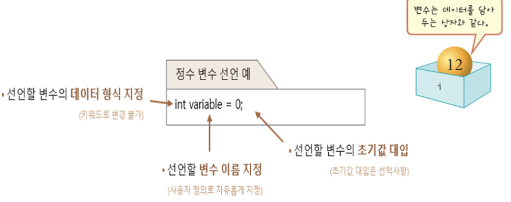
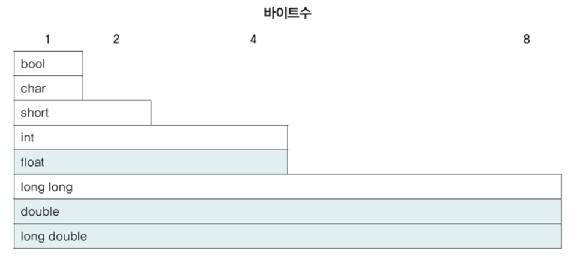
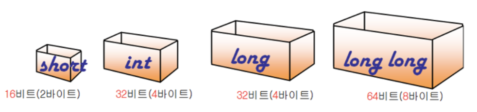
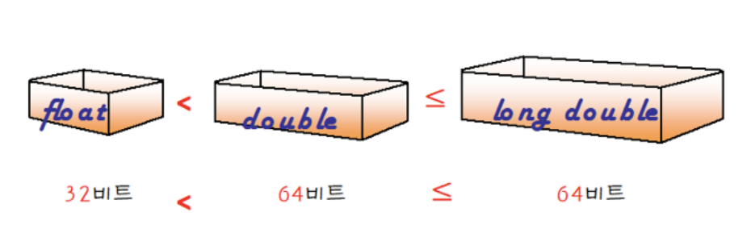
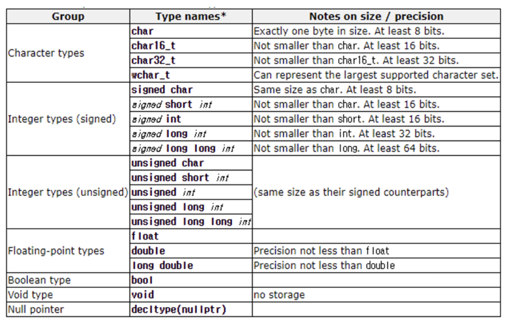

# 2.6 변수와 자료형
## 변수
```
데이터(값)을 저장하는 상자
``` 


## 자료형
### 데이터 형식(자료형)

> 변수가 어떤 형식의 값을 가지는 지 알려주는 것이 `데이터형식(자료형)`

데이터 형식을 개발자가 지정해주는 것이 번거로운 단점이 있음

컴파일러가 데이터 형식을 곧바로 인지하기 때문에 속도가 빠름



### 정수형

### 부동소수점형

### 그 외


<br><br>

# 2.6.1 변수의 선언
### 변수

변수에 값을 저장할 때에는 `=` 기호 사용

```cpp
int i;
i = 100;
```

<br>

변수를 선언과 동시에 초기화 하려면 다음과 같은 형식을 사용
```cpp
int i = 100;
```

<br>

C++11 부터는 변수를 초기화할 때 보편적 초기화 방법을 사용
- 보편적 초기화 방법에서는 `{}` 를 사용하여 변수의 값을 초기화
- 배열이나 객체의 초기화에도 그대로 적용 가능

```cpp
int i{100};         //int i = 100;과 동일
string s {"hello"}; //string s = "hello";와 동일
``` 

<br><br>

# 2.6.2 변수의 유효 범위와 형식 변환

## 변수의 유효 범위

>변수가 선언된 위치에 따라 사용할 수 있는 범위가 결정
<br> 
선언 번위가 다른 경우 변수 사용이 허용되지 않음

- 동일 범위 내 이름이 같은 변수를 사용할 수 없는 `단일 정의 규칙`
- 다른 범위에서는 같은 이름으로 변수를 선언해도 오류가 발생하지 않음

### C++ 언어의 대표적인 범위

구분 | 범위
---|---
구문 범위 | `it, for, while` 등의 구문 내부
지역 범위 | 매개변수 이름을 포함, 함수 안에 선언한 이름은 해당 함수 내에서만 유효 (블록범위`block scope` 라고 지칭)
전역 범위 | 네임스페이스나 클래스, 함수 등에 속하지 않고 외부, 선언 지점부터 파일 끝까지 해당
클래스 범위 | 클래스 정의 전체 해당. 클래스 맴버에 대한 접근성은 접근 지정자(`public, private`등)로 제어할 수 있음
네임스페이스 범위 | 네임스페이스 내부, 네임스페이스는 서로 다른 파일들의 여러 블록에서 선언될 수 있음

<br>

##### 예제 : 유효 범위(지역 범위가 적용) 
```cpp
#include <iostream>
using namespace std;

void print() {
	// 함수 내부의 지역 변수
	int value = 10;
	cout << "print 함수 내부에서의 지역 변수 value: " << value << endl;
}

int main() {
	// main 함수 내부의 지역 변수
	int value = 5;
	cout << "main 함수 내부에서의 지역 변수 value: " << value << endl;

	// print 함수 호출
	print();

	// print 함수 호출 후에도 main 함수의 value에 영향을 주지 않음
	cout << "다시 main 함수 내부에서의 지역 변수 value: " << value << endl;

	return 0;
}
```

<br>

##### 예제 : 유효 범위(전역, 지역 변수 구분) 
```cpp
#include <iostream>
using namespace std;

int value = 1; 	// 전역 변수

int main() {

	int value = -1; 	// 지역 변수

	cout << value << endl; 	// 지역 변수 출력
	cout << ::value << endl; 	// 전역 변수 출력

	return 0;
}
```

<br><br>

## L-value와 R-value 비교

> 각각 **왼쪽** 값(left value) **오른쪽** 값(right value)을 의미.

모든 경우가 이 법칙을 따르지 않음
- 위치보다는 각 값의 특성으로 구별
- 대입 연산자`=` 를 기준으로 왼쪽항을 L-value, 오른쪽 항을 R-value로 구분

### L-value
주로 대입 연산자의 **왼쪽**에 나타나는 값
- 메모리 위치를 가리키거나 수정할 수 있는 표현식
- 예 : *변수 이름, 배열 요소, 클래스 맴버* 

### R-value
주로 대입 연산자의 **오른쪽**에 나타나는 값
- 임시 값이나 메모리 상에 위치가 없는 값을 가리키는 표현식
- 예 : *임시 객체*, *리터럴* 

L-value | R-value
---| ---
대입연산자 좌변 | 대입연산자 우변
메모리 위치 가리킴 | 위치 가리키지 않음
이름 있음 | 이름 없음
사용되는 식 외에도 유효 | 사용되는 식에서만 임시 유효

<br>

## 형식 변환(type casting)
변수 선언 시 지정된 데이터 형식 변경이 필요할 경우가 존재

<br>

### 데이터 유지, 데이터 유실
- 적은 범위 표현이 가능한 형식을 큰 범위로 변환 시 데이터 유실 없음
    - `char → short → int → long`, `int → float → double `등

- 큰 범위 표현이 가능한 형식을 적은 범위 형식으로 변경 시 데이터 유실 가능
    - `long → int → short → char `, `double → float → int`

### 표현 데이터 계열이 다를 경우 변환 불가 또는 잘못된 변환 발생
- `string → int`,`wchar_t → double`등

### 변환 방식에 따른 구분
> `암시적 형 변환` (implict cast)

컴파일러가 자동으로 변경

> `명시적 형 변환 ` (explict cast)

개발자가 의도적으로 직접 변경

<br>

## 암시적 형 변환
암시적 변환 실행

1. 첫 번째 암시적 변환 `float → double`<br><br>
동일 계열, 큰 범위로 변환 : 숫자 승격, `데이터 유지`

```cpp
int int_value = 10;
float float_value = int_value;
```

<br>

2. 두 번째 암시적 변환 `float → int`<br><br>
동일 계열, 적은 범위로 변환 : 숫자 변환, `데이터 유실`

```cpp
double double_value = 2.0;
int int_value = double_value;
```

##### 암시형 형 변환 예제
```cpp
#include <iostream>
using namespace std;

int main()
{
	float float_value = 1.5f; 	// 원본 데이터는 부동 소수점 형 1.5
	double double_value = float_value; // 숫자 승격: 데이터 유실 없음
	int int_value = float_value; 	// 숫자 변환: 데이터 유실 발생

	cout << "float_value: " << float_value << endl;
	cout << "double_value: " << double_value << endl;
	cout << "int_value: " << int_value << endl;

	return 0;
}
```

<br><br>

## 명시적 형 변환
### 암시적 형 변환 코드에서 데이터 유실 발생

숫자 승격이지만, 계산 순서때문에 유실 발생

`(int_a + int_b) / 2` 의 결과를 `int`로 처리 이후 `float`로 변환

> 🔨 명시적으로 `(int_a + int_b) / 2` 를 `float`로 변환 후 연산 시 데이터 유지

- `float(int_a + int_b)`로 결괏값을 15.0f 명시적 형 변환 후 연산 진행
- 정수형 `R_value`를 실수형 `R-value`로 명시적 형 변환 한 경우

```cpp
float float_avg_2 = (float)(int_a + int_b) / 2;
```

<br>

### 명시적 형 변환에서도 데이터 유실 발생함
다른 데이터 계열, 적은 범위로의 명시적 형 변환 역시 데이터 유실 발생

형 변환 시점이 중요한 연산에서 명시적 형 변환으로 오류 발생 방지

##### 명시적 형 변환 예제
```cpp
#include <iostream>
using namespace std;

int main()
{
	int int_a = 10;
	int int_b = 5;

	int int_avg = (int_a + int_b) / 2;
	float float_avg_1 = (int_a + int_b) / 2; 	        // 암시적 형 변환(데이터 유실)
	float float_avg_2 = float(int_a + int_b) / 2;     // 명시적 형 변환

	cout << "int_avg: " << int_avg << endl;
	cout << "float_avg_1: " << float_avg_1 << endl;
	cout << "float_avg_2: " << float_avg_2 << endl;

	return 0;
}
```

<br>


<br><br>

# 2.6.3 논리형
``` 
bool
```
C++ 에서 ANSI/ISO 표준으로 추가

`bool` 형의 변수는 `참(true)` 또는 `거짓(false)`만을 가질 수 있음

- true와 false 는 정수 1과 0을 의미
- 선택문이나 반복문에서 조건을 나타내는데 사용

<br><br>

# 2.6.4 `void` 
형식이 없음을 표현하는 키워드로 변수 선언에는 **사용하지 않음**

``` 
다음과 같은 세 가지 경우 `void`키워드 사용

1. 함수의 반환 값이 없다는 것을 표시
2. 함수의 매개 변수가 없다는 의미
3. 모든 변수를 가리킬 수 있는 제네릭 포인터 (generic pointer)
```

