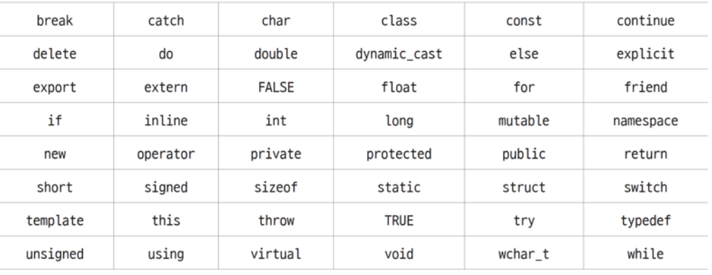

# 2.7 키워드와 리터럴

## 키워드란?
```
프로그래밍 언어에서 특별한 의미로 미리 정의해 둔 식별자

변수 이름 클래스 이름 등 식별자와 구별되는 예약어
```

`C++20` 기준 **97**개 단어가 키워드로 예약되어 있음


<br>

## 식별자 생성 규칙
> C++ 언어의 식별자는 특별한 규칙에 맞게 생성해야 컴파일러가 정상적으로 처리할 수 있습니다.

키워드는 식별자로 사용할 수 없다.

식별자는 대소 문자, 숫자, 문자로만 구성할 수 있다.

식별자는 대소 문자 또는 밑줄(_)로만 시작해야하 한다.
- **숫자로 시작할 수 없다.**

대문자와 소문자를 구별한다.
- `nvalue`, `NVALUE`, `nValue` 각각 다르게 취급

<br>

## 리터럴(literal)

```
값 그 자체를 나타낸다.
``` 

### 코드에 직접 표현된 변하지 않는 값 그 자체
- 5, 0.5, 'A' 등과 같은 변하지 않는 값이 리터럴

```cpp
int value = 5;
double value = 0.5;
char value = 'A';
```

### 리터럴 데이터 형식

리터럴 | 데이터 형식 | 예시
--- | --- | ----
문자 | char | 'A'
정수 | int | 0, 1, 2, -1, -2
부동 소수점 | double | 0.5, 1.5, -0.5
문자열 | char[] | "Hello", "안녕하세요"
불리언 | bool | true, false

<br>

## 접미사를 붙여 지칭하는 리터럴
```cpp
float value = 0.5f;
unsigned int value = 5u;
long value = 5L;
```

### 접미사
데이터 형식 | 리터럴 접미사
---| ---
unsigned int | u,U
long | l,L
unsigned long | ul,uL, Ul, UL, lu, lU, Lu, LU
long long | lL, LL
unsigned long long | ull, uLL, Ull, llu, llU , LLu, LLU
float | f, F
long double | l,L

# 2.7.1 사용자 정의 리터럴
사용자가 직접 리터럴 정의 및 사용 가능
리터럴 접미사를 정의하여 사용, `operator" "`를 활용하여 정의

```cpp
//사용자 정의 리터럴
반환_타입 operator"" 리터럴_접미사(매개변수_구성)
``` 

### 사용자 정의 리터럴 예
```cpp
long double operator"" _km(long double val)
``` 

<br>

##### 예제 : 사용자 정의 리터럴로 거리 단위 변환

```cpp
#include <iostream>
using namespace std;

const long double km_per_mile = 1.609344L;

long double operator"" _km(long double val) 	// _km 사용자 리터럴 정의
{
	return val;
}

long double operator"" _mi(long double val) 		// _mi 사용자 리터럴 정의
{
	return val * km_per_mile;
}

int main()
{
	long double distance_1 = 1.0_km; 	// 킬로미터는 그대로 저장
	long double distance_2 = 1.0_mi; 	// 마일은 킬로미터 단위로 변환해서 저장

	cout << distance_1 << " km" << endl; // 킬로미터로 출력
	cout << distance_2 << " km" << endl; // 킬로미터로 출력
	cout << distance_1 + distance_2 << " km" << endl; // 킬로미터로 출력
	return 0;
}
```