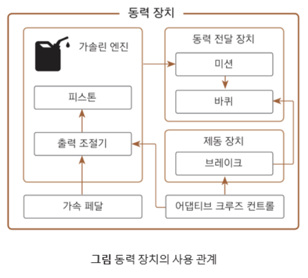

# 3.1 객체에 대한 이해

<br>

# 3.1.1 객체 지향 이전의 프로그래밍 패러다임
## 프로그램 패러다임
``` 
프로그램을 어떤 절차와 구조로 만들 것인지에 대한 스타일이나 접근 방법
``` 
언어가 지원하는 기능, 코드의 구조, 문제 해결 접근 방식 등에 다름

*비구조적 프로그래밍, 절차적 프로그래밍 및 객체지향 프로그래밍 등*

<br>

## 비구조적 프로그래밍
``` 
코드를 구조화 하지 않고 작성하는 방법
``` 
첫 번째 줄 부터 마지막 줄까지 차례대로 실행

코드의 흐름을 이동하는 **`goto` 문 사용**이 특징임

*어셈블리어(assembly language), 초창기의 포트란(fortran)*

<br>

## 절차적 프로그래밍
> 소스 코드를 여러 부분으로 나눠서 활용, 프로시저를 이용해 구조화

**`프로시저(procedure)`** : 일련의 코드 묶음, 보통 함수를 지정함

*C 언어, 코볼(cobol), 포트란(fortran) 등*

코드를 논리 구조로 **`모듈화(modulation)`**
- 동일 기능 수행코드 재작성 불필요
- 재사용을 위해 기능을 묶어 라이브러리 모듈로 제공

<br>

### 구조화된 코드는 다른 사람이 쉽게 읽을 수 있음 (가독성 향상)
표 : 어댑티브 크루즈 컨트롤 기능을 위한 함수와 변수 예

기능 | 함수 이름 | 필요 변수
--|--|--
엔진 출력 조정 | `acceleration_adjusting` | `target_speed, current_speed`
가속 페달 조정 | `acceleration_output`| 
브레이크 조정 | ` pushing_break`|
앞차와의 거리 조절 | `inquiring_range`|
주행 중 차량 속도 측정 | `inquiring_current_speed` |
적절한 목표 속도 계산 | `caculating_fit_speed` |

변수 | 변수 이름 | 관련 기능
--|--|--
주기 조절 | `acceleration_adjusting_period` | `acceleration_adjusting`

<br>

##  예제 : 절차적 프로그래밍
```cpp
//전역 변수들
int user_target_speed;
int acceleration_adjusting_period;
//전역 함수들
void acceleration_output();
void pushing_break();
int inquiring_current_speed();
int inquiring_range();
int calculating_fit_speed(int range, int original_target_speed);
void acceleration_adjusting(int target_speed, int current_speed){
    if(target_speed == current_speed){
        return;
    }
    if(target_speed > current_speed){
        acceleration_output();
        return;
    }
    pushing_break();
}
//메인 소스 코드
void main(){
    int range, current_speed;
    while (do_cruise) {
        range = inquring_range();
        current_speed = inquiring_current_speed();
        acceleration_adjusting(calculating_fit_speed(range, user_target_speed), current_speed);
        sleep(acceleration_adjusting_period);
    }
    return 0;
}
```


## 절차적 프로그래밍 효과

속도 조절 기능 변경이 필요한 경우
- `acceleration_adjusting` 함수 내부만 변경

코드 수정에 영향(기능에 맞춘 수정, 수정된 프로시저 호출 코드 등)을 최소화 할 수 있음

### 프로시저
프로시저를 기능 단위로 구현 시 기능 변경 영향 범위 최소화 가능
- 기능 정의 프로시저는 흐름에 영향을 미치지 않아 상시 수정 가능

상기 특징을 적용하여 절차적 프로그래밍 구성
- 프로그램의 중심 흐름을 담당하는 흐름 코드와 프로시저 뭉치로 구별


<br>

## 절차적 프로그래밍 문제점


# 3.1.2 절차적 프로그래밍 개념
``` 
객체지향 프로그래밍은 데이터와 함수를 포함하는 객체를 활용하는 프로그래밍 패러다임이다.
다양한 객체 간의 관계를 소스코드로 구성하여 프로그램을 완성한다.
```

### 접근 방식 차이
**프로그램(큰 규모, 상위)**의 기능을 **프로시저(작은 규모, 하위)**로 분할하는 절차적 프로그래밍
- 큰 규모 → 작은 규모 또는 상위 → 하위로 접근하는 하향식 방식

**논리적 단위 객체(작은 규모, 하위)**의 조합으로 **프로그램(큰 규모, 상위)**를 만드는 객체 지향 프로그래밍
- 작은 규모 → 큰 규모 또는 하위 → 상위로 접근하는 상향식 방식

**객체 지향 프로그래밍**은 데이터(속성)와 함수(기능)을 가진 객체(하위)를 먼저 **정의, 객체의 조합으로 프로그램(상위) 구성**
- 재활용 관점에서 유용 : 하위 구조의 활용도를 높이기 위해 범용성을 우선 고려할 수 있음

<br>


<br>

# 3.1.3 객체 프로그래밍 필요성
## 객체를 사용한 현실 세계 모델링
### 추상화
현실 세계의 대상을 논리적으로 구조화를 위해 **단순화, 일반화** 하는 과정

아래 그림은 자동차 및 동력 장치를 추상화 하여 모델링(구조화)한 결과


<br />

###  객체 간 사용관계

객체 역할과 포함 관계는 정적인 관계, 순간적인 구조만 설명 가능

사용 관계는 객체 간의 동적인 관계를 설명하는 기본적인 설명이다. 
- 객체 간 종속성을 알려주는 관계



<br />
<br />

## 객체 간 논리적 계층 관계 표현 

### 대표 객체와 파생 객체 

비슷한 역할을 하는 객체의 공통 특성만 포함한 대표 객체 

대표 객체의 공통 특성을 물려 받고 새로운 특성을 추가한 한 파생 객체

- **상속** : 대표(상위) 객체에서 파생 객체를 만드는 것

엔진(대표 객체) 의 특성을 상속 받아 상세화 한 가솔린, 디젤, 가스, 전기 엔진(파생 엔진)

- "가솔린 엔진은 엔진의 한 종류다" 라고 말할 수 있으므로 `is-a` 관계 성립

`is-a` 관계는 상호 교환이 가능함.

- 즉, 가솔린 엔진은 엔진을 대체 할 수 있음 (`has-a` 관계는 불가능)


