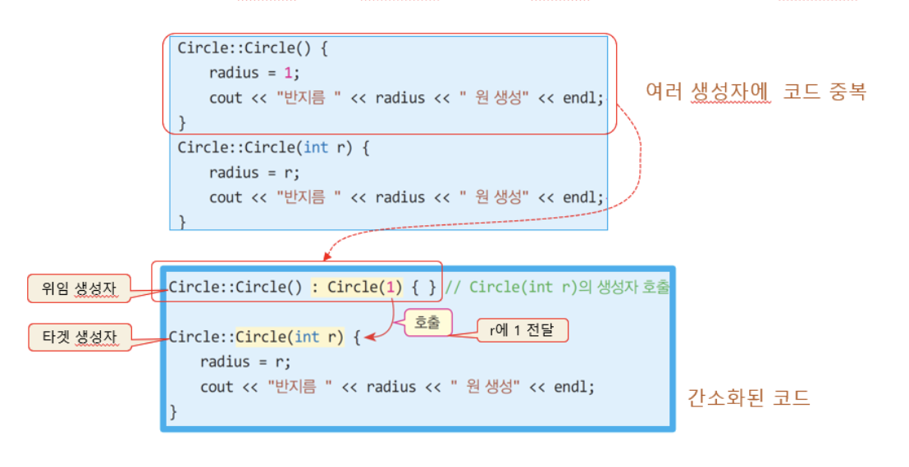
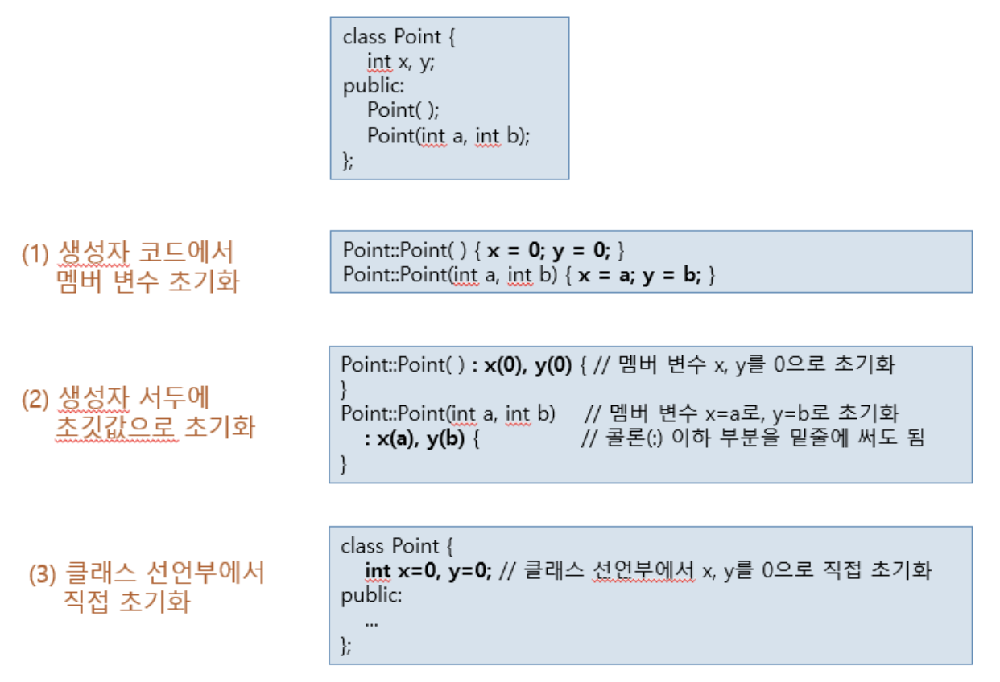

# 3.3 생성자


```
생성자(constructor)

객체가 생성되는 시점에서 자동으로 호출되는 맴버 함수
class 이름과 동일한 맴버 함수
``` 
```cpp
class Circle {
    ..
    Circle();       //클래스 이름과동일 
    Circle(int r);  //중복선언 가능, 리턴 타입 명기하지 않음
    ..
};
//생성자 함수 구현
Circle::Circle(){}  //매개 변수가 없는 생성자
Circle::Circle(int r){}//매개 변수를 가진 생성자
``` 

# 3.3.1 생성자 함수 특징
> 생성자의 목적

객체가 생성될 때 객체가 **필요한 초기화**를 위해
- *맴버 변수 값 초기화, 메모리 할당, 파일 열기, 네트워크 연결 등*

<br>

> 생성자 이름

반드시 클래스 이름과 **동일**

<br>

> 생성자는 **리턴 타입을 선언하지 않는다**.

리턴 타입 없음. `void`도 안됨

<br>

> 객체 생성 시 오직 한 번만 호출

**자동**으로 호출됨. 임의로 호출 불가. 각 객체마다 생성자 실행

<br>

> 생성자는 **중복** 가능

생성자는 한 클래스 내에 여러 개 가능

중복된 생성자 중 하나만 실행

<br>

> 생성자가 선언되어 있지 않으면 `기본 생성자` **자동으로 실행**

기본 생성자 : 매개 변수 없는 생성자

컴파일러에 의해 자동생성

<br>

##### 예제 : 2개의 생성자를 가진 Circle 클래스 
```cpp
#include <iostream> 
using namespace std; 

class Circle {
public:
	int radius;
	Circle(); // 매개 변수 없는 생성자
	Circle(int r); // 매개 변수 있는 생성자
	double getArea();
}; 

Circle::Circle() {
	radius = 1;
	cout << "반지름 " << radius << " 원 생성" << endl;
}

Circle::Circle(int r) {
	radius = r;
	cout << "반지름 " << radius << " 원 생성" << endl;
}

double Circle::getArea() {
	return 3.14*radius*radius;
}

int main() {
	Circle donut; // 매개 변수 없는 생성자 호출
	double area = donut.getArea();
	cout << "donut 면적은 " << area << endl;

	Circle pizza(30); // 매개 변수 있는 생성자 호출
	area = pizza.getArea();
	cout << "pizza 면적은 " << area << endl;
}
```

<br><br>

# 3.3.2 객체 생성 및 생성자 실행과정


<br><br>

# 3.3.3 생성자가 다른 생성자 호출(`위임 생성자`)

여러 생성자에 중복 작성된 코드의 간소화

> 타겟 생성자와 이를 호출하는 위임(delegating) 생성자로 나누어 작성
- `타겟 생성자` : 객체를 초기화를 전담하는 생성자
- `위임 생성자` : 타겟 생성자를 호출하는 생성자, 객체 초기화를 타겟 생성자에 위임



##### 예제 : 생성자에서 다른 생성자 호출 연습(위임생성자 만들기)
```cpp
#include <iostream> 
using namespace std; 

class Circle {
public:
	int radius;
	Circle(); // 위임 생성자
	Circle(int r); // 타겟 생성자
	double getArea();
}; 

Circle::Circle() : Circle(1) { } // 위임 생성자


Circle::Circle(int r) { // 타겟 생성자
	radius = r;
	cout << "반지름 " << radius << " 원 생성" << endl;
}

double Circle::getArea() {
	return 3.14*radius*radius;
}

int main() {
	Circle donut; // 매개 변수 없는 생성자 호출
	double area = donut.getArea();
	cout << "donut 면적은 " << area << endl;

	Circle pizza(30); // 매개 변수 있는 생성자 호출
	area = pizza.getArea();
	cout << "pizza 면적은 " << area << endl;
}
```

<br><br>

# 3.3.4 다양한 생성자의 맴버 변수 초기화 방법



## 예제 : 맴버 변수의 초기화와 위임생성자 활용
```cpp
#include <iostream>
using namespace std;

class Point {
	int x, y;
public:
	Point();
	Point(int a, int b);
	void show() { cout << "(" << x << ", " << y << ")" << endl; }
};

Point::Point() : Point(0, 0) { } // 위임 생성자
Point::Point(int a, int b) // 타겟 생성자
	: x(a), y(b) { }

int main() {
	Point origin;
	Point target(10, 20);
	origin.show();
	target.show();
}
```
```
(0,0)
(10,20)
```

<br>
<br>
<br>

# 3.3.5 기본 생성자

### 생성자는 꼭 있어야 하는가?
```
예, C++ 컴파일러는 객체가 생성될 때, 생성자 반드시 호출
``` 

### 개발자가 클래스에 생성자를 작성해 놓지 않으면?
``` 
컴파일러에 의해 기본 생성자가 자동으로 생성
``` 

<br>
<br>

## 기본 생성자란?
> 클래스에 생성자가 하나도 선언되어 있지 않은 경우, 컴파일러가 대신 삽입해주는 생성자
<br>
<br>
매개 변수 없는 생성자
<br>
<br>
디폴트 생성자(`default constructor`) 라고도 불림

```cpp
class Circle{
	Circle();	
}
```

<br>
<br>
<br>

# 3.3.6 기본 생성자가 자동으로 생성되는 경우

> 1. 생성자가 하나도 작성되어 있지 않은 클래스의 경우

컴파일러가 기본 생성자 자동 생성


<br>

> 2. 생성자가 하나라도 선언된 클래스의 경우

컴파일러는 기본 생성자를 자동 생성하지 않음

```cpp
class Circle{
public:
	int radius;
	double getArea();
	Circle(int r);				//Circle 클래스에 생성자가 선언되어 있기 때문에 컴파일러는 기본 생성자를 자동생성하지 않음
};

Circle::Circle(int r){
	radius = r;
}

int main(){
	Circle pizza(30);			//호출 Circle()
	Circle donut;				//컴파일러 오류 : 기본 생성자 없음
}
```

<br>
<br>

## 예제 : Rectnagle Class 만들기

> 다음 `main()`함수가 잘 작동하도록 `Rectangle 클래스`를 작성하고 프로그램을 완성하라.
<br> `Rectangle 클래스`는 `width`와 `height` 의 두 맴버 변수와 `3` 개의 생성자, 그리고 `isSquare()` 함수를 가진다. 

```cpp
int main(){
	Rectangle rect 1;
	Rectangle rect 2(3,5);
	Rectangle rect 3(3);

	if(rect1.isSquare()) cout << "rect1은 정사각형이다. "<<endl;
	if(rect2.isSquare()) cout << "rect2는 정사각형이다. "<<endl;
	if(rect3.isSquare()) cout << "rect3는 정사각형이다. "<<endl;
}
``` 

```
rect1은 정사각형이다.
rect3는 정사각형이다.
``` 


### 정답

```cpp
#include <iostream> 
using namespace std; 

class Rectangle { 
public:
	int width, height; 

	Rectangle();
	Rectangle(int w, int h);
	Rectangle(int length);
	bool isSquare();
};

Rectangle::Rectangle() {
	width = height = 1;
}

Rectangle::Rectangle(int w, int h) {
	width = w; height = h;
}

Rectangle::Rectangle(int length) {
	width = height = length;
}

// 정사각형이면 true를 리턴하는 멤버 함수
bool Rectangle::isSquare() { 
	if(width == height) return true;
	else return false;
}

int main() {
	Rectangle rect1; 
	Rectangle rect2(3, 5);
	Rectangle rect3(3);

	if(rect1.isSquare()) cout << "rect1은 정사각형이다." << endl ;
	if(rect2.isSquare()) cout << "rect2는 정사각형이다." << endl;
	if(rect3.isSquare()) cout << "rect3는 정사각형이다." << endl;
}
``` 