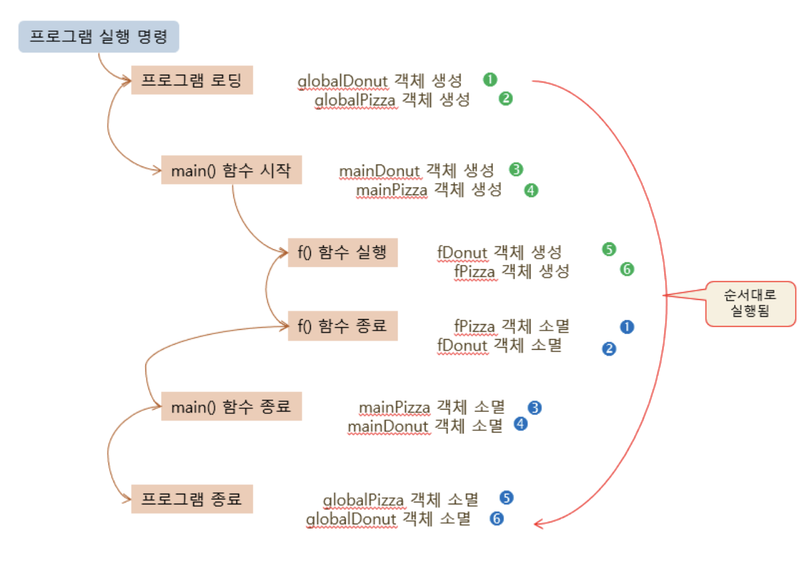

# 3.4 소멸자

```
객체가 소멸되는 시점에서 자동으로 호출되는 함수
``` 
오직 한 번만 자동 호출, 임의로 호출 불가

객체 메모리 소멸 직전 호출

```cpp
class Circle{
    Circle();
    Circle(int r);
    ..
    //소멸자 함수 선언
    ~Circle();
    //리턴타입, 매개 변수 없음. 소멸자는 오직 하나만 존재
};
//소멸자 함수 구현
Circle::~Circle(){} 
``` 

# 3.4.1 소멸자 특징
> 소멸자의 목적
- 객체가 사라질 때 **마무리 작업**을 위함
- *실행 도중 동적으로 할당 받은 메모리 해제, 파일 저장 및 닫기, 네트워크 닫기 등*

<br>

> 소멸자 함수의 이름은 클래스 앞에 `~` 를 붙인다.
- *`Circle::~Circle()`*

<br>

> 소멸자는 리턴 타입이 없고, 어떤 값도 리턴하면 안됨
- 리턴 타입 선언 불가

<br>

> **중복 불가능**
- 소멸자는 한 클래스 내에 오직 한 개만 작성 가능
- 소멸자는 매개 변수 없는 함수

<br>

> 소멸자가 선언되어 있지 않으면 `기본 소멸자`가 자동 생성
- 컴파일러에 의해 기본 소멸자 코드 생성
- 컴파일러가 생성한 `기본 소멸자` : 아무것도 하지 않고 단순 리턴

<br>

##### 예제 : Circle 클래스에 소멸자 작성 및 실행
```cpp
#include <iostream> 
using namespace std; 

class Circle {
public:
	int radius; 

	Circle(); 
	Circle(int r); 
	~Circle(); // 소멸자
	double getArea();
}; 


Circle::Circle() {
	radius = 1;
	cout << "반지름 " << radius << " 원 생성" << endl;
}

Circle::Circle(int r) {
	radius = r;
	cout << "반지름 " << radius << " 원 생성" << endl;
}

Circle::~Circle() {
	cout << "반지름 " << radius << " 원 소멸" << endl;
}

double Circle::getArea() {
	return 3.14*radius*radius;
}

int main() {
	Circle donut; 
	Circle pizza(30); 

	return 0;
}
```

<br><br>

# 3.4.2 생성자/소멸자 실행 순서
<br>

## 객체가 선언된 위치에 따른 분류
<br>

> 지역 객체(`local object`)
- 함수 내에 선언된 객체로서, 함수가 종료하면 소멸된다.

> 전역 객체(`global object`)
- 함수의 바깥에 선언된 객체로서, 프로그램이 종료할 때 소멸된다.

```cpp
class Circle {
public:
};

Circle globalCircle;    //전역 객체
void f(){
    Circle localCirclel //지역 객체
}
``` 

<br>

## 객체 생성 순서

### 객체 생성 순서
전역 객체는 프로그램에 선언된 순서로 생성

지역 객체는 함수가 호풀되는 순간에 순서대로 생성

<br>

### 객체 소멸 순서
함수가 종료하면, 지역 객체가 생성된 순서의 역순으로 소멸

프로그램이 종료하면, 전역 객체가 생성된 순서의 역순으로 소멸

<br>

### `new`를 이용하여 동적으로 생성된 객체의 경우
`new` 를 실행하는 순간 객체 생성

`delete` 연산자를 실행할 때 객체 소멸

<br>

##### 예제 : 지역 객체와 전역 객체의 생성 및 소멸 순서
```cpp
#include <iostream> 
using namespace std; 

class Circle {
public:
	int radius; 
	Circle(); 
	Circle(int r); 
	~Circle(); 
	double getArea(); 
}; 

Circle::Circle() {
	radius = 1;
	cout << "반지름 " << radius << " 원 생성" << endl;
}

Circle::Circle(int r) {
	radius = r;
	cout << "반지름 " << radius << " 원 생성" << endl;
}

Circle::~Circle() {
	cout << "반지름 " << radius << " 원 소멸" << endl;
}

double Circle::getArea() {
	return 3.14*radius*radius;
}

Circle globalDonut(1000);
Circle globalPizza(2000);

void f() {
	Circle fDonut(100);
	Circle fPizza(200);
}

int main() {
	Circle mainDonut;
	Circle mainPizza(30);
	f();
}
```


