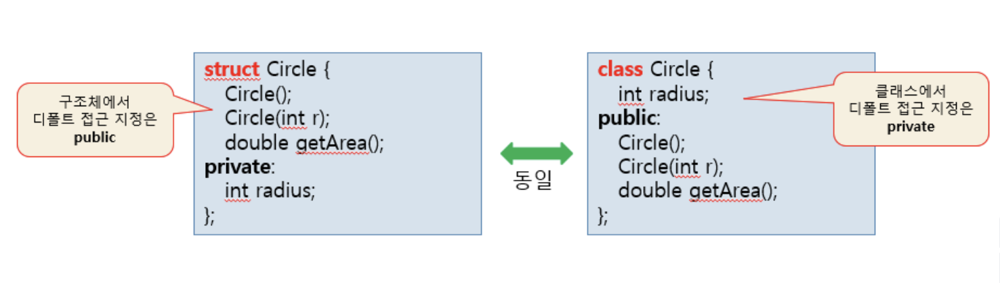

# 3.7 C++ 구조체

```
상속, 맴버, 접근 지정 등 모든 것이 클래스와 동일
``` 

### 클래스와 유일하게 다른 점
- 구조체의 디폴트 접근 지정 : `public`
- 클래스의 디폴트 접근 지정 : `private`

### C++에서 구조체를 수용하는 이유
C 언어와의 호환성 때문

C 의 구조체 100% 호환 수용

C 소스를 그대로 가져다 쓰기 위해

```cpp
struct StructName {
private:    //private 맴버 선언
protected:  //protected 맴버 선언
public:     //public 맴버 선언
};
``` 
### 구조체 객체 생성
`struct` 키워드 생략

```cpp
structName stObj;       //(O) C++ 구조체 객체 생성
struct structName stObj;    //(X) C 언어의 구조체 객체 생성
``` 

<br><br>

# 3.7.1 구조체와 클래스 디폴트 접근 지정 비교


<br>

##### 예제 : Circle 클래스를 C++ 구조체를 이용하여 재작성
```cpp
#include <iostream>
using namespace std;

// C++ 구조체 선언
struct StructCircle {
private:
	int radius;
public:
	StructCircle(int r) { radius = r; }  // 구조체의 생성자
	double getArea(); 
};

double StructCircle::getArea() {
	return 3.14*radius*radius;
}

int main() {
	StructCircle waffle(3);
	cout << "면적은 " << waffle.getArea();
}
```

<br><br>

# 3.8 바람직한 C++ 프로그램 작성법

