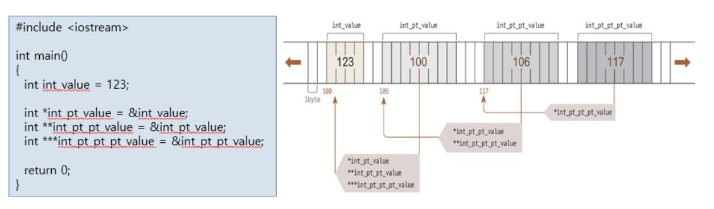

# 4.1 객체 포인터

# 4.1.1 포인터와 메모리

### 변수와 메모리 주소

정적 선언 변수 메모리 구조 

- 프로그램 실행 후 각 ㄱ변수는 고유한 주소가 할당(확보)되고 값을 기록함

- 변수 이름으로 메모리에 저장된 값을 사용함

```cpp
#include <iostream>

int main(){
    char char_value = 'A';
    int int_value = 123;
    double double_value = 123.456;

    return ();
}
```


<br><br><br>

# 4.1.2 포인터와 연산자

> 포인터는 메모리 주소를 저장하는 변수

이전 페이지 그림의 시작 메모리 주소를 저장

> 일반 변수처럼 `int`나 `char`와 같은 데이터 형식 지정

일반 변수와 다르게 자료형과 변수 이름 사이에 별표`(*)` 추가 

``` 
포인터 변수 선언

자료형 *(포인터_변수_이름);
``` 

> 포인터 변수에 일반 변수의 메모리 주소를 저장

>> 변수 앞에 `&`을 붙이면 변수의 시작 메모리 주소 반환

주소 연산자 `&`는 비트 AND 연산자의 기호와 같지만, **주소 연산자**로 사용할 때에는 **`단항 연산자`** 이고 **비트 AND 연산자로** 사용할 때는 **`이항 연산자`**(혼동 주의)


<br><br><br>

## 포인터 변수의 크기

### 1

포인터 변수 크기는 데이터 형식과 무관하게 동일 (8byte, 4byte)

포인터가 저장하는 데이터는 메모리 주소.

- 메모리에 저장된 데이터 형식과는 무관한 크기

```cpp
int *lotto_pointer;           //int 형 데이터를 가리키는 포인터
double *lotto_double_pointer  //double형 데이터를 가리키는 포인터
``` 

다음 데이터 주소를 찾기 위해 데이터 형식 지정이 필요함.

연속된 메모리에서 다음 메모리 위치 이동시 필요한 메모리 크기가 필요함


<br><br>

### 2

포인터 변수 크기는 데이터 형식과 무관하게 동일 (8byte, 4byte)

포인터가 저장하는 데이터는 메모리 주소.

- 메모리에 저장된 데이터 형식과는 무관한 크기

```cpp
int *lotto_pointer;           //int 형 데이터를 가리키는 포인터
double *lotto_double_pointer  //double형 데이터를 가리키는 포인터
``` 

다음 데이터 주소를 찾기 위해 데이터 형식 지정이 필요함.

연속된 메모리에서 다음 메모리 위치 이동시 필요한 메모리 크기가 필요함


<br><br><br>

# 4.1.3 포인터와 연산자 : 포인터 변수가 가리키는 `데이터`에 접근하기

```cpp
#include <iostream>
using namespace std;

int main() 
{
  char char_value = 'A’;
  int int_value = 123;
  double double_value = 123.456;

  char *char_pointer_value = &char_value;
  int *int_pointer_value = &int_value;
  double *double_pointer_value = &double_value;

  // 일반 변수의 데이터 출력
  cout << "char_value: " << char_value << endl;
  cout << "int_value: " << int_value << endl;
  cout << "double_value: " << double_value << endl;
  cout << endl;

  // 역참조 연산자로 포인터 변수가 가리키는 데이터 출력
  cout << "*char_pointer_value: " << *char_pointer_value << endl;
  cout << "*int_pointer_value: " << *int_pointer_value << endl;
  cout << "*double_pointer_value: " << *double_pointer_value << endl;
  cout << endl;
  // 역참조 연산자로 원본 데이터 덮어쓰기
  *char_pointer_value = 'Z’;
  *int_pointer_value = 321;
  *double_pointer_value = 654.321;

  // 일반 변수의 데이터 출력(업데이트 확인)
  cout << "char_value: " << char_value << endl;
  cout << "int_value: " << int_value << endl;
  cout << "double_value: " << double_value << endl;

  return 0;
}
```
```
Main.cpp:6:21: warning: missing terminating ' character
    6 |   char char_value = 'A’;
      |                     ^
Main.cpp:6:21: error: missing terminating ' character
    6 |   char char_value = 'A’;
      |                     ^~~~
Main.cpp:26:25: warning: missing terminating ' character
   26 |   *char_pointer_value = 'Z’;
      |                         ^
Main.cpp:26:25: error: missing terminating ' character
   26 |   *char_pointer_value = 'Z’;
      |                         ^~~~
Main.cpp: In function ‘int main()’:
Main.cpp:7:3: error: expected primary-expression before ‘int’
    7 |   int int_value = 123;
      |   ^~~
Main.cpp:11:29: error: ‘int_value’ was not declared in this scope
   11 |   int *int_pointer_value = &int_value;
      |                             ^~~~~~~~~
make: *** [cmd] Error 1
```

## 포인터 변수가 가리키는 데이터에 접근하기

포인터 변수를 사용할 때 역참조 연산자 `*`를 사용 : 포인터 변수가 가리키는 데이터값에 접근

- `*char_pointer_value = 'Z';`처럼 새로운 값을 넣으면 `char_value` 변수의 값이 `'Z'`로 변경

역참조 연산자 `*`는 그림에서 화살표를 따라가는 연산자로 이해


<br><br><br>

# 4.1.4 포인터와 연산자 : `다중 포인터`

포인터 역시 메모리 주소를 할당 받기 때문에 **다른 포인터로 시작 메모리 주소를 저장** 할 수 있음.

**포인터의 포인터**를 사용(`다중 포인터`라고 함)

> 역참조자를 두 개(`**`) 붙여 **포인터의 메모리 주소**를 저장할 수 있는 이중 포인터가 선언

이중 포인터의 메모리 주소를 저장, 역참조자를 세 개 (`***`)붙여 삼중 포인터를 선언



<br><br><br>

# 4.1.5 배열과 포인터 : 배열
변수 여러 개를 **하나로 묶어** 간단하게 선언하는 방법

`배열_이름[인덱스]`로 개별 변수에 값을 읽기/쓰기, 인덱스는 배열 위치 지정

인덱스 범위는 0부터 배열 크기(`n`)보다 하나 적은 `n-1`까지 사용


```cpp
#include <iostream>
using namespace std;

int main()
{
  int lotto[45] = { 1, 2, 3, 4, 5, 6, 7, 8, 9, 10, 11, 12, 13, 14, 15,
                    16, 17, 18, 19, 20, 21, 22, 23, 24, 25, 26, 27, 28, 29, 30,
                    31, 32, 33, 34, 35, 36, 37, 38, 39, 40, 41, 42, 43, 44, 45 };

 cout << "Today's Lotto : "
       << lotto[0] << ", " << lotto[7] << ", " << lotto[15] << ", "
       << lotto[27] << ", " << lotto[36] << ", " << lotto[44] << endl;

  return 0;
}
```
```
> Today's Lotto : 1, 8, 16, 28, 37, 45
```

<br><br><br>

# 4.1.6 배열과 포인터 : 배열 메모리 확인

주소 연산자 `&` 로 배열 각 원소의 주소 값 출력

16진수 메모리 주소 값이 `4`씩 증가하는 것을 확인할 수 있음(`int`의 크기는 `4byte`)

```cpp
#include <iostream>
using namespace std;

int main()
{
  int lotto[45] = { 1, 2, 3, 4, 5, 6, 7, 8, 9, 10, 11, 12, 13, 14, 15,
                    16, 17, 18, 19, 20, 21, 22, 23, 24, 25, 26, 27, 28, 29, 30,
                    31, 32, 33, 34, 35, 36, 37, 38, 39, 40, 41, 42, 43, 44, 45 };

  cout << "lotto[0] Address: " << &lotto[0] << endl;
  cout << "lotto[1] Address: " << &lotto[1] << endl;
  cout << "lotto[2] Address: " << &lotto[2] << endl;
  cout << "lotto[3] Address: " << &lotto[3] << endl;
  cout << "lotto[4] Address: " << &lotto[4] << endl;
  cout << "lotto[5] Address: " << &lotto[5] << endl;
  
  return 0;
}
```
```
> lotto[0] Address: 0x7fff15a21e80
lotto[1] Address: 0x7fff15a21e84
lotto[2] Address: 0x7fff15a21e88
lotto[3] Address: 0x7fff15a21e8c
lotto[4] Address: 0x7fff15a21e90
lotto[5] Address: 0x7fff15a21e94
```

<br><br><br>

# 4.1.7 배열과 포인터 : 포인터 연산으로 배열의 원소에 접근하기

```cpp
#include <iostream>
using namespace std;

int main()
{
  int lotto[45] = { 1, 2, 3, 4, 5, 6, 7, 8, 9, 10, 11, 12, 13, 14, 15,
                    16, 17, 18, 19, 20, 21, 22, 23, 24, 25, 26, 27, 28, 29, 30,
                    31, 32, 33, 34, 35, 36, 37, 38, 39, 40, 41, 42, 43, 44, 45 };

  cout << "lotto[0] Address: " << &lotto[0] << endl;
  cout << "lotto[1] Address: " << &lotto[1] << endl;
  cout << "lotto[2] Address: " << &lotto[2] << endl;
  cout << "lotto[3] Address: " << &lotto[3] << endl;
  cout << "lotto[4] Address: " << &lotto[4] << endl;
  cout << "lotto[5] Address: " << &lotto[5] << endl;

  cout << "(lotto + 0) Address: " << lotto + 0 << endl;
  cout << "(lotto + 1) Address: " << lotto + 1 << endl;
  cout << "(lotto + 2) Address: " << lotto + 2 << endl;
  cout << "(lotto + 3) Address: " << lotto + 3 << endl;
  cout << "(lotto + 4) Address: " << lotto + 4 << endl;
  cout << "(lotto + 5) Address: " << lotto + 5 << endl;
  
  return 0;
}
```
```
> lotto[0] Address: 0x7ffded726b00
lotto[1] Address: 0x7ffded726b04
lotto[2] Address: 0x7ffded726b08
lotto[3] Address: 0x7ffded726b0c
lotto[4] Address: 0x7ffded726b10
lotto[5] Address: 0x7ffded726b14
(lotto + 0) Address: 0x7ffded726b00
(lotto + 1) Address: 0x7ffded726b04
(lotto + 2) Address: 0x7ffded726b08
(lotto + 3) Address: 0x7ffded726b0c
(lotto + 4) Address: 0x7ffded726b10
(lotto + 5) Address: 0x7ffded726b14
```

<br><br>

## 배열과 포인터 연산의 관계

> 배열의 **이름**은 `첫 번째 원소`를 가르키기 때문에 표 왼쪽과 오른쪽 결과를 비교하면 각 `원소의 주소`와 `포인터 연산 결과` **일치**

`&배열_변수[인덱스] == 배열_변수 + 인덱스`

- 첫 번째 원소에서 인덱스 만큼 뒤쪽 원소

- 예 : `&lotto[2] == lotto + 2`


## 배열과 포인터 비교 

배열의 이름은 첫 번째 (인덱스 `0`) 원소의 주소값을 가리킴

포인터 변수는 `증감 연산자`도 사용가능

- `++`는 다음 원소, `--`는 이전 원소로 포인터 위치 변경


<br><br><br>

# 4.1.8 배열과 포인터 : 배열과 포인터는 같을까?

포인터 연산은 포인터와 유사하게 동작

그러나 포인터와 배열은 **다른 데이터 형식**임

예제에서 `동일한 주소`를 가르키지만 `데이터 크기`가 **다름**

구분 | 특징
---|----
배열 | 배열 전체의 크기, 즉 **데이터를 모두 가지고** 있음
포인터 | 포인터 데이터 형식의 크기, 즉 데이터의 **주소값을 가르키기만** 함

```cpp
#include <iostream>
using namespace std;
 
int main() 
{
  int array[5] = { 1, 2, 3, 4, 5 };
  int *pointer_array = array;

  cout << "array: " << array << endl;
  cout << "pointer_array: " << pointer_array << endl << endl;
  
  cout << "sizeof(array): " << sizeof(array) << endl;
  cout << "sizeof(pointer_array): " << sizeof(pointer_array) << endl;
 
  return 0;
}
```
```
array: 0000008D1B1CFAD8
pointer_array: 0000008D1B1CFAD8

sizeof(array): 20
sizeof(pointer_array): 8
```

<br><br><br>

# 4.1.9 객체에 대한 포인터

> C언어의 포인터와 동일, 객체의 주소 값을 가지는 변수

### 객체에 대한 포인터 변수 선언
```cpp
Circle *p;  //Circle 타입의 객체에 대한 포인터 변수 p선언
``` 

### 포인터 변수에 객체 주소 지정
객체의 주소는 객체 이름 앞에 `&` 연산자를 사용하여 표현

```cpp
p = &donut;     //p에 donut 객체의 주소 저장
Circle *p = donut;//포인터 변수 선언시 객체 주소로 초기화
``` 

### 포인터를 이용한 객체 맴버 접근

객체 이름으로 맴버를 접근할 때는 점(`.`)연산자 이용
```cpp
double d = donut_getArea(); //객체 이름으로 맴버 함수 호출
``` 

객체 포인터로 맴버를 접근할 때는 `->`연산자 이용
```cpp
double d = p -> getArea();  //포인터로 객체 맴버 함수 호출
double d = (*p).getArea(;)  //역참조 연산자로 객체 맴버 함수 호출
``` 


## 예제 : 객체 포인터 선언 및 활용
```cpp
#include <iostream>
using namespace std;

class Circle {
	int radius; 
public:
	Circle() {	radius = 1; }
	Circle(int r)  { radius = r; }
	double getArea(); 
}; 

double Circle::getArea() {
	return 3.14*radius*radius;
}

int main() {
	Circle donut;
	Circle pizza(30);

	// 객체 이름으로 멤버 접근
	cout << donut.getArea() << endl;

	// 객체 포인터로 멤버 접근
	Circle *p;
	p = &donut;
	cout << p->getArea() << endl; // donut의 getArea() 호출
	cout << (*p).getArea() <<endl; // donut의 getArea() 호출

	p = &pizza; 
	cout << p->getArea() << endl; // pizza의 getArea() 호출
	cout << (*p).getArea() << endl; // pizza의 getArea() 호출
}
```
```
> 3.14
3.14
3.14
2826
2826
```