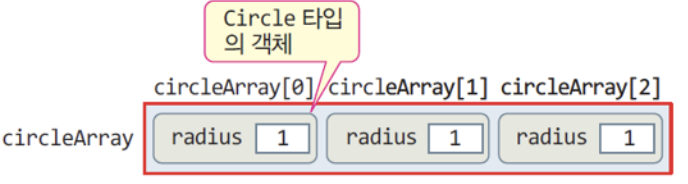

# 4.2 객체 배열

## 예제 : Circle 클래스의 배열 선언 활용
```cpp
#include <iostream>
using namespace std;

class Circle {
	int radius; 
public:
	Circle() {	radius = 1; }
	Circle(int r)  { radius = r; }
	void setRadius(int r)  { radius = r; } 
	double getArea(); 
}; 

double Circle::getArea() {
	return 3.14*radius*radius;
}

int main() {
	Circle circleArray[3]; 										// (1) Circle 객체 배열 생성

	// 배열의 각 원소 객체의 멤버 접근
	circleArray[0].setRadius(10); 							// (2)
	circleArray[1].setRadius(20);
	circleArray[2].setRadius(30);

	for(int i=0; i<3; i++) // 배열의 각 원소 객체의 멤버 접근
		cout << "Circle " << i << "의 면적은 " << circleArray[i].getArea() << endl;

	Circle *p; 															// (3)
	p = circleArray; 												// (4)
	for(int i=0; i<3; i++) { 	// 객체 포인터로 배열 접근
		cout << "Circle " << i << "의 면적은 " << p->getArea() << endl;
		p++; 															// (5)
	}
}
```
```
> Circle 0의 면적은 314
Circle 1의 면적은 1256
Circle 2의 면적은 2826
Circle 0의 면적은 314
Circle 1의 면적은 1256
Circle 2의 면적은 2826
```

# 4.2.1 배열 생성과 활용 (위 예제 실행과정)


<br><br><br>

# 4.2.2 객체 배열, 생성 및 소멸
```cpp
#include <iostream>
using namespace std;

class Circle {
	int radius; 
public:
	Circle() {	radius = 1; }
	Circle(int r)  { radius = r; }
	void setRadius(int r)  { radius = r; } 
	double getArea(); 
}; 

double Circle::getArea() {
	return 3.14*radius*radius;
}
```

## 객체 배열 선언 가능

### 기본 타입 배열 선언과 형식 동일
```
int n[3];  //정수형 배열 선언

Circle c[3];   // Circle 타입의 배열 선언
```

### 객체 배열 선언

객체 배열을 위한 공간 할당
```
Circle cicleArray[3];
```

### 객체 배열 선언문은 오직 매개 변수 없는 기본 생성자 호출

배열의 각 원소 객체마다 생성자 실행

- `c[0]`의 생성자, `c[1]`생성자, `c[2]`생성자 실행

```cpp
Circle::Circle(){radius = 1;}
```



<br><br>

## 객체 배열 생성 시 기본 생성자 호출


# 4.2.3 객체 배열, 생성 및 소멸 : 객체 배열 사용
```cpp
#include <iostream>
using namespace std;

class Circle {
	int radius; 
public:
	Circle() {	radius = 1; }
	Circle(int r)  { radius = r; }
	void setRadius(int r)  { radius = r; } 
	double getArea(); 
}; 

double Circle::getArea() {
	return 3.14*radius*radius;
}
```

### 배열의 각 원소 객체는 `[]` 연산자로 구분

원소 객체와 맴버 사이에 점(`.`)연산자 사용

- `circleArray`의 각 `Circle`객체의 `serRadius()` 맴버 함수 호출

```cpp
circleArray[0].setRadius(10);
circleArray[1].setRadius(20);
circleArray[2].setRadius(30);
```

객체 배열로 `circleArray`의 각 객체 면적을 화면에 출력
```cpp
for(int i=0; i<3; i++) // 배열의 각 원소 객체의 멤버 접근
		cout << "Circle " << i << "의 면적은 " << circleArray[i].getArea() << endl;
```

`Circle`클래스의 포인터를 이용하여 배열을 처리
```cpp
Circle *p; 															// (3)
	p = circleArray; 												// (4)
	for(int i=0; i<3; i++) { 	// 객체 포인터로 배열 접근
		cout << "Circle " << i << "의 면적은 " << p->getArea() << endl;
		p++; 															// (5)
	}
```

## 포인터 p를 다르게 활용할 수 있음
```cpp
p[0].getArea();     //배열의 첫 번째 Circle 객체의 getArea()함수 호출
(*p).getArea();     //위와 동일한 코드 (역참조 연산자)
``` 

앞의 `for`문을 `p[i]`를 사용하여 작성하면
```cpp
Circle circleArray[3];
```
```cpp
Circle *p = circleArray;   //p는 circleArray 배열을 가리킨다.
for (int i = 0; i < 3; i ++){
    cout << "Circle " << i << "의 면적은" << p[i].getArea() << endl;
}
```
<br><br><br>

# 4.2.4 배열 소멸과 소멸자

### 함수가 종료하면 함수 내에 선언된 배열도 소멸

> 배열이 소멸되면, 모든 원소 객체가 소멸되며 각 원소 객체마다 소멸자 호출 (생성의 반대순으로 소멸)

높은 인덱스에서부터 원소 객체가 소멸되고, 각 객체마다 `~Circle()` 소멸자가 실행

```cpp
circleArray[2] 소멸자 실행 → circleArray[1] 소멸자 실행 → circleArray[0] 소멸자 실행
``` 

<br><br><br>

# 4.2.5 객체 포인터를 사용하여 객체 배열을 다루는 다양한 사례

### 1. 포인터 p를 이용하여 객체처럼 접근
```cpp
Circle *p = circleArray;
for (int i = 0; i < 3 ; i++)
    cout << (*p++).getArea() << endl;
```
(*p++)

### 2. 배열의 이름 circleArray를 포인터로 사용
```cpp
for(int i = 0; i < 3; i++)
    cout << (circleArray +i) -> getArea() <<endl;
```
circleArray + i

### 3. 포인터 p의 정수 연산 이용
```cpp
Circle *p = circleArray;
for (int i = 0; i < 3; i ++)
    cout << (p++)-> getArea() << endl;
```
p++

<br><br><br>

# 4.2.6 객체 배열 초기화

## 객체 배열 초기화 방법

> 객체 배열을 생성할 때 생성자를 사용하여 원소 객체를 초기화

객체 배열 선언문을 오직 매개 변수 없는 기본 생성자를 호출

배열의 각 원소당 생성자 지정하는 방법

```cpp
Circle circleArray[3] = {Circle(10), Circle(20), Circle()};
```

- 각각 `circleArray[0,1,2]` 객체가 생성될 때, 생성자 `Circle(10), Circle(20), Circle()` 호출


## 예제 : 객체 배열 초기화
```cpp 
#include <iostream>
using namespace std;

class Circle {
	int radius; 
public:
	Circle() {	radius = 1; }
	Circle(int r)  { radius = r; }
	void setRadius(int r)  { radius = r; } 
	double getArea(); 
}; 

double Circle::getArea() {
	return 3.14*radius*radius;
}

int main() {
	Circle circleArray[3] = { Circle(10), Circle(20), Circle() }; // Circle 배열 초기화

	for(int i=0; i<3; i++) 
		cout << "Circle " << i << "의 면적은 " << circleArray[i].getArea() << endl;
}
```
```
> Circle 0의 면적은 314
Circle 1의 면적은 1256
Circle 2의 면적은 3.14
```

<br><br><br>

# 4.2.7 2차원 배열


## 예제 : Circle 클래스의 2차원 배열 선언 및 활용

```cpp
#include <iostream>
using namespace std;

class Circle {
	int radius; 
public:
	Circle() {	radius = 1; }
	Circle(int r)  { radius = r; }
	void setRadius(int r)  { radius = r; } 
	double getArea(); 
}; 

double Circle::getArea() {
	return 3.14*radius*radius;
}

int main() {
	Circle circles[2][3];

	circles[0][0].setRadius(1);
	circles[0][1].setRadius(2);
	circles[0][2].setRadius(3);
	circles[1][0].setRadius(4);
	circles[1][1].setRadius(5);
	circles[1][2].setRadius(6);

	for(int i=0; i<2; i++)  	// 배열의 각 원소 객체의 멤버 접근
		for(int j=0; j<3; j++) {
			cout << "Circle [" << i << "," << j 	<< "]의 면적은 ";
			cout << circles[i][j].getArea() <<endl;
		}
}
```
```
 Circle [0,0]의 면적은 3.14
Circle [0,1]의 면적은 12.56
Circle [0,2]의 면적은 28.26
Circle [1,0]의 면적은 50.24
Circle [1,1]의 면적은 78.5
Circle [1,2]의 면적은 113.04
``` 
