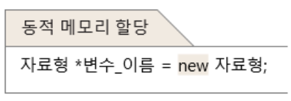
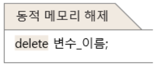
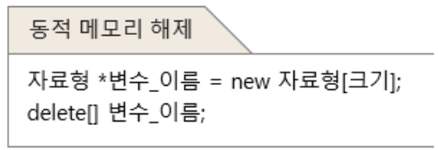
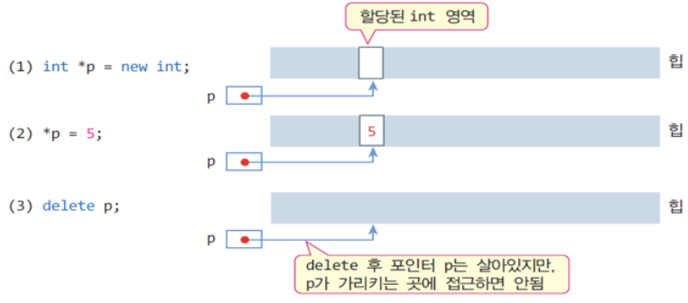

# 4.3 동적 메모리 할당과 반환

### 정적 할당

**변수 선언**을 통해 필요한 메모리 할당
- **많은 양**의 메모리는 배열 선언을 통해 할당

### 동적 할당

필요한 양이 예측 되지 않는 경우
- 프로그램 작성시 *할당 받을 수 없음*

실행 중에 힙(`heap`) 메모리에서 할당
- 힙은 운영체제가 프로세스(프로그램)의 실행을 시작 시킬 때 *동적 할당 공간*으로 준 메모리 공간

### C언어의 동적 메모리 할당

`malloc()/free()` 라이브러리 함수 사용

# 4.3.1 C++ 의 동적 메모리 할당/ 반환 : new와 delete연산자

## new 연산자

기본 타입 메모리 할당, 배열 할당, 객체 할당, 객체 배열 할당

객체의 동적 생성
- 힙 메모리로부터 객체를 위한 메모리 할당 요청

객체 할당 시 생성자 호출


## delete 연산자

`new`로 할당 받은 메모리 반환

객체의 동적 소멸
- 소멸자 호출 뒤 객체를 힙에 변환



## 배열도 동적 할당, 해제가 가능함


<br><br><br>

# 4.3.2 C++의 기본 연산자
## new/delete 연산자의 사용 형식

데이터 타입은 `int, char, double` 등 기본 타입 뿐만아니라 구조체(`struct`), 클래스(`class`) 도 포함

```cpp
데이터타입 *포인터변수 = new 데이터타입;
delete 포인터변수;
``` 

<br>

## new/delete 의 사용 
```cpp
int *pInt = new int;    //int 타입의 메모리 동적 할당
char *pChar = new char ;    //char 타입의 메모리 동적 할당
Circle *pCircle = new Circle    //Circle 클래스 타입의 메모리 동적 할당

delete pInt;    //할당받은 정수 공간 반환
delete pChar;   //할당받은 문자 공간 반환
delete pCircle; //할당받은 객체 공간 반환
``` 

<br><br>

## new/delete 연산자의 사용 형식

힙 메모리가 부족하면 new NULL 을 리턴, 리턴 값을 검사해야함
```cpp
int *p = new int;   //int 타입의 메모리 동적 할당
if(!p){             //if(p==NULL)과 동일.
    return;         //메모리 할당받기 실패
}

*p = 5;             //할당받은 정수 공간에 5기록
int n = *p          //할당받은 정수 공간에서 값 읽기 n = 5
delete p;           //할당 받은 정수 공간 반환
``` 



<br><br>

## 동적 할당 메모리 초기화
new 를 이용하여 메모리를 할당 받을 때, 초깃값을 저장하여 초기화
```cpp
데이터 타입 *포인터변수 = new 데이터타입(초깃값)
``` 
```cpp
//20으로 초기화 된 int 공간 할당
int *pInt = new int(20);
//'a'로 초기화 된 char 공간 할당
char *pChar = new char('a');
``` 
<br><br>

## delete 사용 시 주의 사항

적절치 못한 포인터로 delete하면 실행 시간 오류 발생

동적으로 할당 받지 않은 메모리 반환 : **오류** 
```cpp
int n;
int *p = &n;
delete p; 
// 실행 시간 오류. 포인터 p가 가리키는 메모리를 동적으로 할당 받은 것이 아님
```

동일한 메모리 두 번 반화 : **오류**
```cpp
int *p = new int;
delete p;
delete p;
// 첫 번째는 정상적인 메모리 반환이지만 
// 두 번째는 실행시간 오류. 이미 반환한 메모리 중복 반환 불가
```
## 예제 : 정수형 공간의 동적 할당 및 반환 예
```cpp
#include <iostream>
using namespace std;

int main() {
	int *p;

	p = new int; 
	if(!p) {
		cout << "메모리를 할당할 수 없습니다.";
		return 0;
	}

	*p = 5; // 할당 받은 정수 공간에 5 삽입
	int n = *p;
	cout << "*p = " << *p << '\n';
	cout << "n = " << n << '\n';

	delete p;
}
```
```
*p = 5
n = 5
```


<br><br><br>

# 4.3.3 동적 메모리 할당


## 동적 할당 메모리를 해제하는 이유

일반 변수와 동적 할당 메모리는 메모리 영역이 **다름**

### 일반 변수

`스택` 메모리 영역에 할당, 함수 종료 시 자동으로 소멸

할당 가능한 영역이 적고, 이를 초과시 OS가 강제종료하기도 함(stack overflow)

### 동적 할당 메모리
`힙` 메모리 영역에 할당, 함수 종료 등과 무관하게 유지

할당 가능한 영역이 크고, 개발자가 직접 관리해야함

### 메모리 누수

```
함수에서 포인터 변수 선언, 메모리를 할당하고 해제 없이 함수 종료 시 메모리 누수 발생
```

메모리 누수는 누적이 되고, 사용가능 힙 영역이 줄어듬

- 포인터 변수는 일반 변수이고 포인터 변수가 가르키는 메모리를 할당하기 때문에, 포인터 변수가 사라져도 힙에 할당된 메모리는 유지됨

- 그리고 메모리를 해제하기 위해 주소를 찾아갈 방법이 없어집니다.

<br>

아래는 함수 종료 후 힙에 할당된 메모리가 누수되는 과정


## new/delete 연산자의 사용 형식


## 예제 : 정수형 배열의 동적 할당 및 반환
```cpp
#include <iostream>
using namespace std;

int main() {
	cout << "입력할 정수의 개수는?";
	int n;
	cin >> n; // 정수의 개수 입력
	if(n <= 0) return 0;
	int *p = new int[n]; // n 개의 정수 배열 동적 할당
	if(!p) { 
		cout << "메모리를 할당할 수 없습니다.";
		return 0;
	}

	for(int i=0; i<n; i++) {
		cout << i+1 << "번째 정수: "; // 프롬프트 출력
		cin >> p[i]; // 키보드로부터 정수 입력
	}

	int sum = 0;
	for(int i=0; i<n; i++)
		sum += p[i];
	cout << "평균 = " << sum/n << endl;

	delete [] p; // 배열 메모리 반환
}
```
```
입력할 정수의 개수는?3
1번째 정수: 1
2번째 정수: 2
3번째 정수: 3
평균 = 2
```

# 4.3.4 동적 할당 메모리 초기화

동적 할당 시 초기화
```cpp
데이터 타입 *포인터변수 = new 데이터타입(초깃값)
``` 
```cpp
//20으로 초기화 된 int 공간 할당
int *pInt = new int(20);
//'a'로 초기화 된 char 공간 할당
char *pChar = new char('a');
``` 

### 배열은 동적 할당 시 직접 초깃값으로 초기화 불가능
```cpp
int *pArray = new int[10](20);  //(20) 구문오류
int *pArray = new int (20)[10]; //(20) 구문오류 

int *pArray = new int []{1,2,3,4}   //1,2,3,4로 초기화된 정수 배열생성
``` 

### delete 시 [] 생략
컴파일 오류는 아니지만 비정상적인 반환
```cpp
int *p = new int[10];
delete p;   
// 비 정상적인 반환. delete [] p;가 정답

int *q = new int;
delete [] q;
//비정상적 반환. delete q; 가 정답
``` 
