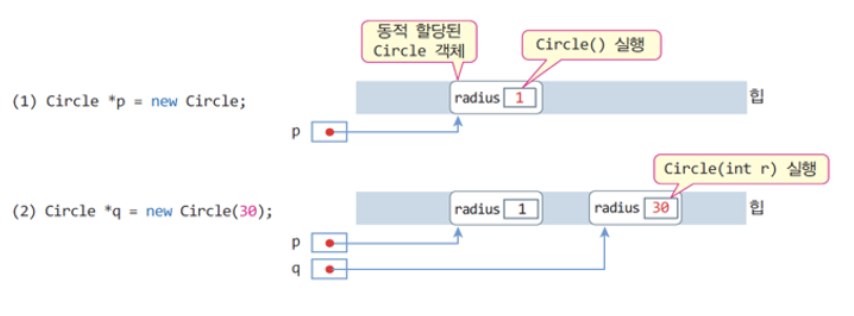

# 4.4 객체와 객체 배열의 동적 생성 및 반환

# 4.4.1 `new`를 이용한 객체의 동적 생성과 생성자

`new` 연산자를 이용하여 객체를 동적 생성하는 구문

```cpp
클래스이름 *포인터변수 = new 클래스이름;                   //기본 생성자 호출

클래스이름 *포인터변수 = new 클래스이름(생성자매개변수리스트)   //매개변수 있는 생성자 호출
``` 

> `new`는 클래스 크기의 메모리를 할당 받아 객체를 생성하며, 이때 생성자를 호출

```cpp
Circle *p = new Circle ;        //기본생성자 Circle() 호출, p = new Circle(); 과 같음

Circle *q = new Circle(30);     //생성자 Circle(30) 호출
``` 



<br>
<br>
<br>

# 4.4.2 `delete`를 이용한 객체 반환과 소멸자

동적으로 생성된 객체는 객체에 대한 `포인터 변수`를 이용하여 반환

`delete` 사용시 `포인터 변수`는 반드시 `new`를 이용하여 **동적 할당 받은 메모리의 주소**이어야함

```cpp
Circle donut;
Circle *p = &donut;
delete p;       //실행오류, p가 가리키는 객체는 동적 할당받은 것이 아님
``` 


<br>
<br>

# 4.4.3 `Circle waffle;`과 `Circle waffle()`의 차이점

매개 변수 없는 생성자를 호출할 때 다음 두 개 중 어떤 것인가?

```cpp
Circle waffle;
Circle waffle();

// 답은 첫 번째. 두 번째는 오류를 발생시키지 않지만 경고를 발생시키기도 함
``` 

<br>

컴파일러는 두 번째 문장을 `Circle` 객체를 리턴하는 함수 `waffle()`의 선언으로 인지

- `waffle`은 함수 이름으로 처리되어 아래와 같이 코딩하면 `오류`

```cpp
waffle.getArea(); //ERROR: *getArea() 왼쪽에 클래스가 있어야 합니다.
```

아래의 경우에는 문제 없음

```cpp
Circle *p = new Circle;
Circle *q = new Circle();
```

<br>
<br>
<br>

## 예제 : Circle 객체의 동적 생성 및 반환

```cpp
#include <iostream>
using namespace std;

class Circle {
	int radius; 
public:
	Circle(); 
	Circle(int r);
	~Circle();
	void setRadius(int r) { radius = r; }
	double getArea() { return 3.14*radius*radius; }
}; 

Circle::Circle() {
	radius = 1;
	cout << "생성자 실행 radius = " << radius << endl;
}

Circle::Circle(int r) {
	radius = r;
	cout << "생성자 실행 radius = " << radius << endl;
}

Circle::~Circle() {
	cout << "소멸자 실행 radius = " << radius << endl;
}

int main() {
	Circle *p, *q;
	p = new Circle;
	q = new Circle(30);
	cout << p->getArea() << endl << q->getArea() << endl;
	delete p; 
	delete q;
}
```

```
생성자 실행 radius = 1
생성자 실행 radius = 30
3.14
소멸자 실행 radius = 1
소멸자 실행 raiuds = 30
```

## 예제 : Circle 객체의 동적 생성과 반환 응용
```cpp
#include <iostream>
using namespace std;

class Circle {
	int radius; 
public:
	Circle(); 
	Circle(int r);
	~Circle();
	void setRadius(int r) { radius = r; }
	double getArea() { return 3.14*radius*radius; }
}; 

Circle::Circle() {
	radius = 1;
	cout << "생성자 실행 radius = " << radius << endl;
}

Circle::Circle(int r) {
	radius = r;
	cout << "생성자 실행 radius = " << radius << endl;
}

Circle::~Circle() {
	cout << "소멸자 실행 radius = " << radius << endl;
}

int main() {
	int radius;
	while(true) {
		cout << "정수 반지름 입력(음수이면 종료)>> ";
		cin >> radius;
		if(radius < 0) break; // 음수가 입력되어 종료한다.
		Circle *p = new Circle(radius); // 동적 객체 생성
		cout << "원의 면적은 " << p->getArea() << endl;
		delete p; // 객체 반환
	}
}
```
```
> 정수 반지름 입력(음수이면 종료)>> 3
생성자 실행 radius = 3
원의 면적은 28.26
소멸자 실행 radius = 3
정수 반지름 입력(음수이면 종료)>> -1
```

<br>
<br>
<br>

# 4.4.4 객체 배열의 동적 생성과 생성자

### `new`를 이용하여 객체 배열을 동적으로 생성하는 구문

```cpp
클래스이름 *포인터변수 = new 클래스이름 [배열크기];
``` 

### 3개의 Circle 객체로 구성된 배열을 동적으로 생성하는 예

```cpp
Circle *pArray = new Circle[3];
// 3개의 Circle 객체 배열의 동적 생성
``` 

<br>

`new`를 이용하여 배열을 생성할 때, 매개 변수 있는 생성자를 직접 호출할 수 **없음**

```cpp
Circle *pArray = new Circle[3](30);
//구문 오류, 컴파일 오류
```

배열을 각 원소 객체로 **초기화** 할 수 있음
```cpp
Circle *pArray = new Circle[3] {Circle(1), Circle(2), Circle(3)};
// 3개의 객체를 반지름 1,2,3으로 각각 초기화
``` 

<br><br>


<br><br><br>

# 4.4.5 객체 배열의 사용


<br><br><br>

# 4.4.6 배열의 반환과 소멸자

`delete` 연산자를 이용하여 동적으로 할당받은 배열을 반환하는 형식

```cpp
delete [] 포인터 변수; //포인터 변수가 가리키는 객체 배열을 반환
``` 
<br><br>

`pArray`가 가리키고 있는 배열을 반환하는 `delete`문의 예

```cpp
Circle *pArray = new Circle[3];
delete [] pArray;
```

<br><br>

`delete`는 `pArray`가 가리키는 배열을 반환하기 직전, 배열의 각 원소 객체의 소멸자를 실행

소멸자 실행 순서는 생성의 반대 순서로 실행 

```cpp
pArray[2] 객체의 소멸자 → pArray[1] 객체의소멸자 → pArray[0] 객체의 소멸자 실행
```

## 예제 : Circle 배열의 동적 생성 및 반환

```cpp
#include <iostream>
using namespace std;

class Circle {
	int radius; 
public:
	Circle(); 
	Circle(int r);
	~Circle();
	void setRadius(int r) { radius = r; }
	double getArea() { return 3.14*radius*radius; }
}; 

Circle::Circle() {
	radius = 1;
	cout << "생성자 실행 radius = " << radius << endl;
}

Circle::Circle(int r) {
	radius = r;
	cout << "생성자 실행 radius = " << radius << endl;
}

Circle::~Circle() {
	cout << "소멸자 실행 radius = " << radius << endl;
}

int main() {
	Circle *pArray = new Circle [3]; // 객체 배열 생성

	pArray[0].setRadius(10);
	pArray[1].setRadius(20);
	pArray[2].setRadius(30);

	for(int i=0; i<3; i++) {
		cout << pArray[i].getArea() << '\n';
	}
	Circle *p = pArray; // 포인터 p에 배열의 주소값으로 설정
	for(int i=0; i<3; i++) {
		cout << p->getArea() << '\n';
		p++; // 다음 원소의 주소로 증가
	}

	delete [] pArray; // 객체 배열 소멸
}
```
```
> 생성자 실행 radius = 1
생성자 실행 radius = 1
생성자 실행 radius = 1
314
1256
2826
314
1256
2826
소멸자 실행 radius = 30
소멸자 실행 radius = 20
소멸자 실행 radius = 10
```

<br><br>

## 예제 : 객체 배열의 동적 생성과 반환 응용

```cpp
#include <iostream>
using namespace std;

class Circle {
	int radius; 
public:
	Circle(); 
	~Circle() { }
	void setRadius(int r) { radius = r; }
	double getArea() { return 3.14*radius*radius; }
}; 

Circle::Circle() {
	radius = 1;
}

int main() {
	cout << "생성하고자 하는 원의 개수?";
	int n, radius;
	cin >> n; // 원의 개수 입력

	Circle *pArray = new Circle [n]; // n 개의 Circle 배열 생성
	for(int i=0; i<n; i++) {
		cout << "원" << i+1 << ": "; // 프롬프트 출력
		cin >> radius; // 반지름 입력
		pArray[i].setRadius(radius); // 각 Circle 객체를 반지름으로 초기화
	}

	int count =0; // 카운트 변수
	Circle* p = pArray;
	for(int i=0; i<n; i++) {
		cout << p->getArea() << ' '; // 원의 면적 출력
		if(p->getArea() >= 100 && p->getArea() <= 200) 
			count++;
		p++;
	}
	cout << endl << "면적이 100에서 200 사이인 원의 개수는 " 
			<< count << endl;

	delete [] pArray; // 객체 배열 소멸
}
```
```
> 생성하고자 하는 원의 개수?3
원1: 1
원2: 2
원3: 3
3.14 12.56 28.26 
면적이 100에서 200 사이인 원의 개수는 0
```

<br><br><br>

# 4.4.7 동적 메모리 할당과 메모리 누수 (memory leak)
