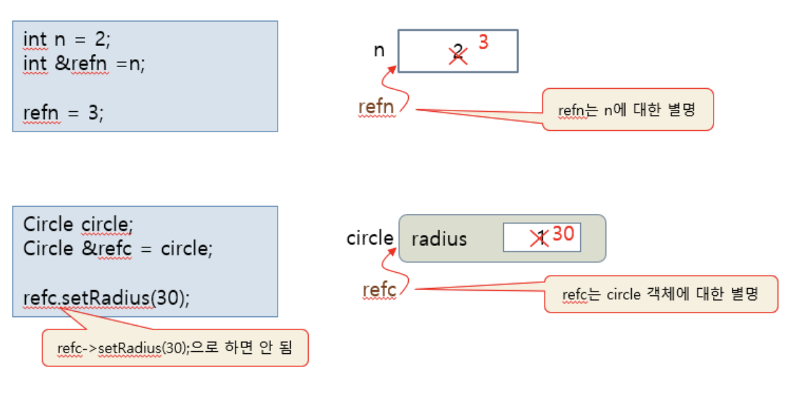

# 5.4 참조와 함수


<br />
<br />

# 5.4.1 참조 변수 

## 참조 변수 선언 

참조자 `&` 의 도입

이미 존재하는 변수 (원본 변수로 지칭) 에 대한 다른 이름 (별명)을 선언

- 참조자`&` 을 이용하여 선언하며, 선언 시 원본 변수로 초기화

```cpp
int n = 2;
int &refn = n;      //참조 변수 refn 선언. refn 은 n의 별명

Circle circle;
Circle &refc = circle   // 참조변수 refc 선언. circle의 별명
``` 

<br />
<br />

# 5.4.2 참조 변수 선언 및 사용 사례

## 참조 변수 선언

참조 변수는 이름만 생기며 새로운 공간을 할당하지 않는다. 

참조 변수는 초기화로 지정된 원본 변수의 공간을 공유한다. 



<br />

## 참조 변수 사용

참조 변수를 사용하는 방법은 보통 변수와 동일 

참조 변수에 대한 사용은 바로 원본 변수의 사용이다.

참조 변수는 포인터가 아니므로 다음과 같이 사용하지 말아야한다. 

참조 변수에 대한 포인터를 만들어 사용가능


<br />
<br />

## 참조 변수 선언 시 주의사항


<br>
<br>

## 예제 : 기본 타입 변수에 대한 참조 
```cpp
#include <iostream>
using namespace std;

int main() {
	cout << "i" << '\t' << "n" << '\t' << "refn" << endl;
	int i = 1;
	int n = 2;
	int &refn = n; // 참조 변수 refn 선언. refn은 n에 대한 별명
	n = 4; 
	refn++; // refn=5, n=5
	cout << i << '\t' << n << '\t' << refn << endl;

	refn = i; // refn=1, n=1
	refn++; // refn=2, n=2
	cout << i << '\t' << n << '\t' << refn << endl;
	
	int *p = &refn; // p는 n의 주소를 가짐
	*p = 20; // refn=20, n=20
	cout << i << '\t' << n << '\t' << refn << endl;
}
```

```cpp
#include <iostream>
using namespace std;

class Circle {
	int radius;
public:
	Circle() { radius = 1; }
	Circle(int radius) { this->radius = radius; }
	void setRadius(int radius) { this->radius = radius; }
	double getArea() { return 3.14*radius*radius; }
};

int main() {
	Circle circle;
	Circle &refc = circle; 
	refc.setRadius(10);
	cout << refc.getArea() << " " << circle.getArea();
}
```

<br>
<br>

# 5.4.3 참조에 의한 호출

### 참조를 가장 많이 활용하는 사례

`call by reference` 라고 부르는 새로운 인자 전달 방식에 많이 사용

## 함수 형식

함수의 매개 변수를 **참조 타입`&`으로 선언**

- 참조 매개 변수 `reference parameter` 라고 부름
    - 참조 매개 변수는 실인자 변수를 참조

- 참조 매개 변수의 이름만 생기고 공간 안 생김

- 참조 매개 변수는 **실인자 변수 공간 공유**

- 참조 매개 변수에 대한 조작은 실인자 변수 조작 효과

```cpp
void swap(int &a, int &b);

int m = 2, n = 9;
swap(m,n);              //참조에 의한 호출
```

```cpp 
void swap(int a, int b);
int m=2, n=9;
swap(m,n);              // 값에 의한 호출   
``` 

- 값에 의한 호출과 모양이 동일하기 때문에 함수의 원형에 의해 구분

## 참조에 의한 호출 사례


<br />
<br />
<br />

# 5.4.4 참조 매개변수가 필요한 사례


이런 문제가 있을 수도 있다.

## 해결 -예제 5.5 참조 매개변수로 평균 리턴하기

참조 매개 변수를 통해 평균을 리턴하고 리턴문을 통해 머시기머시기...

```cpp
#include <iostream>
using namespace std;

bool average(int a[], int size, int& avg) {
	if(size <= 0)
		return false;
	int sum = 0;
	for(int i=0; i<size; i++) 
		sum += a[i];
	avg = sum/size;
	return true;
}

int main() {
	int x[] = {0,1,2,3,4,5};
	int avg;
	if(average(x, 6, avg)) cout << "평균은 " << avg << endl;
	else cout << "매개 변수 오류" << endl;

	if(average(x, -2, avg)) cout << "평균은 " << avg << endl;
	else cout << "매개 변수 오류 " << endl;
}
```
```
평균은 2
매개 변수 오류
``` 

<br>
<br>

# 5.4.5 참조에 의한 호출 

## 참조에 의한 호출 장점

참조 매개 변수를 사용하면 간단히 변수를 넘겨주기만 하면됨

함수 내에서도 참조 매개 변수를 보통 변수처럼 사용하기에 작성하기 쉽고 보기 좋은 코드

- 주소에 의한 호출은 `&`,`*` 의 사용함에 따라서 실수의 가능성과 코드 작성의 긴장감이 배가 되고 코드의 가독성이 떨어짐

<br>

## 참조에 의한 호출로 객체 전달

### 참조에 의한 호출의 작동원리

1. 참조 매개 변수로 이루어진 모든 연산은 원본 객체에 대한 연산이 됨.
2. 참조 매개 변수는 이름만 생성, 생성자와 소멸자는 아예 실행되지 않음

--- 

### 값에 의한 호출의 작동원리

1. 함수 내에서 매개 변수 객체를 변경하여도, 원본 객체를 변경시키지 않음
2. 매개 변수 객체의 생성자가 실행되지 않고 소멸자만 실행되는 **비대칭 구조**로 작동됨

<br>
<br>

## 예제 : 참조에 의한 호출로 Circle 객체에 참조 전달
```cpp
#include <iostream>
using namespace std;

class Circle {
private:
	int radius; 
public:
	Circle(); 
	Circle(int r);
	~Circle();
	double getArea()  { return 3.14*radius*radius; }
	int getRadius() { return radius; }
	void setRadius(int radius) { this->radius = radius; } 
}; 

Circle::Circle() {
	radius = 1;
	cout << "생성자 실행 radius = " << radius << endl;
}

Circle::Circle(int radius) {
	this->radius = radius;
	cout << "생성자 실행 radius = "  << radius << endl;
}

Circle::~Circle() {
	cout << "소멸자 실행 radius = " << radius << endl;
}
```

## 예제: 참조 매개변수를 가진 함수 만들기 연습

```cpp
#include <iostream>
using namespace std;

class Circle {
	int radius;
public:
	Circle() { radius = 1; }
	Circle(int radius) { this->radius = radius; }
	void setRadius(int radius) { this->radius = radius; }
	double getArea() { return 3.14*radius*radius; }
};

//여기 함수를 만들어보기 
void readRadius(Circle &c){
    int r;
    cout << "정수 값으로 반지름을 입력하세요 >>";
    cin >> r;
    c.setRadius(r);     //객체 c에 반지름 설정
}

int main() {
	Circle donut;
	readRadius(donut);
	cout << "donut의 면적 = " <<donut.getArea() << endl;
}
```
```
정수 값으로 반지름을 입력하세요>>
donut의 면적>>
``` 
<br>
<br>
<br>

# 5.4.6 참조 리턴

### C언어의 함수 리턴

함수는 반드시 값만 리턴

- `void`
- 기본 타입 값 : `int, char, double`등
- 포인터(주소) 값

### C++ 의 함수 리턴

함수는 값 외에 참조 리턴 가능

참조 리턴 : 변수 등과 같이 현존하는 공간에 대한 참조 리턴

- 변수의 값을 리턴하는 것이 아님

## 값을 리턴하는 함수 vs 참조를 리턴하는 함수 
```cpp
char c ='a';

char get(){ //char 리턴
    return c;   //c의 문자 'a' 리턴
}

char a = get()  //a='a';
get() = 'b';    //컴파일 오류 
