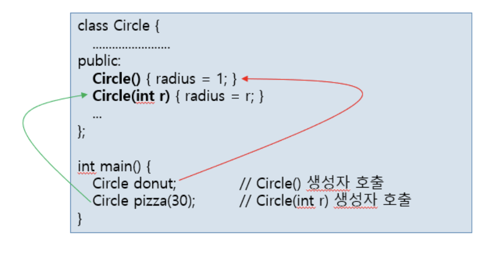

# 6.1 함수 중복

### 동일한 이름의 함수가 공존

다형성

C언어에서는 불가능

### function overloading

### 함수 중복이 가능한 범위

- 보통 함수들 사이
- 클래스의 맴버 함수들 사이
- 상속 관계에 있는 기본 클래스와 파생 클래스의 맴버 함수들 사이

<br>

## 함수 중복 성공 조건

1. 중복된 함수들의 이름 동일
2. 중복된 함수들의 매개 변수 타입이 다르거나 개수가 달라야함
3. 리턴 타입은 함수 중복과 무관

# 6.1.1 함수 중복 성공 사례
```cpp
//성공적으로 중복된 sum()함수들
int sum(int a, int b, int c){
    return a + b + c;
}

double sum(double a, double b){
    return a + b;
}

int sum(int a, int b){
    return a + b;
}


//중복된 sum()함수 호출, 컴파일러가 구분(type)
int main(){
    cout << sum(2,5,33);
    cout << sum(12.5, 33.6);
    cout << sum(2,6);
}
```

<br>
<br>

# 6.1.2 함수 중복 실패 사례

리턴 타입이 다르다고 함수 중복에 성공하지는 않는다. 

> ❗️위의 `main()`코드 `cout << sum(2,5)`에서, 컴파일러는 `int sum()`과 `double sum()` 중 어떤 `sum()` 함수를 호출할 지 구분할 수 없다.

<br><br><br>

# 6.1.3 함수 중복의 편리함

동일한 이름을 사용하면 함수 이름을 구분하여 기억할 필요없고, 함수 호출을 잘못하는 실수를 줄일 수 있다.

컴파일러는 함수 중복이 성공적인지 판별하고 중복된 함수의 호출이 옳은 지 확인한다.

함수 중복은 컴파일 시에 이루어지므로 실행 시간 저하는 없다.

<br><br><br>

## 예제 : `big()`함수 중복 연습
### 조건
큰수를 리턴한 다음 두 개의 big() 함수를 중복 구현하라.

`int big(int a, int b);`: a와 b 중 큰 수 리턴
`int big(int a[], int b[])` : 배열 `a[]`에서 가장 큰 수 리턴

### 코드 

```cpp
#include <iostream>
using namespace std;

int big(int a, int b) { // a와 b 중 큰 수 리턴
	if(a>b) return a;
	else return b;
}

int big(int a[], int size) { // 배열 a[]에서 가장 큰 수 리턴
	int res = a[0];
	for(int i=1; i<size; i++)
		if(res < a[i]) res = a[i];
	return res;
}

int main() {
	int array[5] = {1, 9, -2, 8, 6};
	cout << big(2,3) << endl;
	cout << big(array, 5) << endl;
}
```
### 실행결과
```
3
9
```

## 예제 : `sum()`함수 중복 연습

### 조건

`sum(3,5)`: 3~5까지의 합을 구하여 리턴
`sum(3)` : 0~3까지의 합을 구하여 리턴
`sum(100)`: 0~100까지의 합을 구하여 리턴

### 코드 

```cpp
#include <iostream>
using namespace std;

int sum(int a, int b) { // a에서 b까지 합하기
	int s = 0;
	for(int i=a; i<=b; i++) 
		s += i;
	return s;
}
int sum(int a) { // 0에서 a까지 합하기
	int s = 0;
	for(int i=0; i<=a; i++) 
		s += i;
	return s;
}
int main() {
	cout << sum(3, 5) << endl;
	cout << sum(3) << endl;
	cout << sum(100) << endl;
}
```
### 실행결과
```
12
6
5050
```

<br><br><br>

# 6.1.4 생성자 함수 중복

### 생성자 함수 중복 가능 : 생성자 함수 중복 목적

객체 생성 시, 매개 변수를 통해 다양한 형태의 초깃값 전달.

생성자 호출


<br><br><br>

# 6.1.5 string 클래스의 생성자 중복 사례

### C++ 표준의 string 클래스의 생성자 중복

다양한 생성자를 제공하여 사용자가 다양한 초깃값으로 string 객체를 생성할 수 있도록 함


```cpp
class string{
public:
    string();   //빈 문자열을 가진 스트링 객체 생성
    string(char* s);     //'\0'로 끝나는 C-스트링 s를 스트링 객체로 생성
    string(string& str);        //str을 복사한 새로운 스트링 객체 생성
    ...
}

string str; // 빈 문자열을 가진 스트링 객체
string address("서울시 성북구 삼선동 389");
string copyAddress(address);        //address의 문자열을 복사한 별도의 copyAddress 생성
``` 

<br><br><br>

# 6.1.6 소멸자 함수 중복

### 소멸자 함수 중복 불가

소멸자는 매개 변수를 가지지 않음

한 클래스 내에서 소멸자는 오직 하나만 존재

```cpp
#include <iostream>
using namespace std;

class Circle{
private:
    int radius;
public:
    Circle();
    Circle(int r);
    ~Circle();
};

Circle::~Circle(){
    cout << "소멺자 실행 radius = " << radius << endl;
}
```