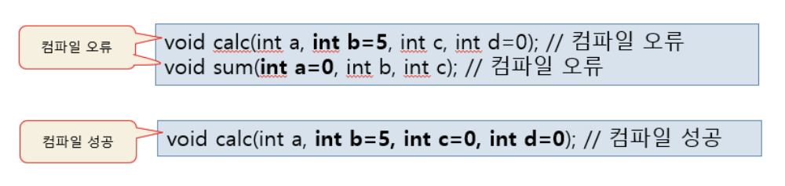
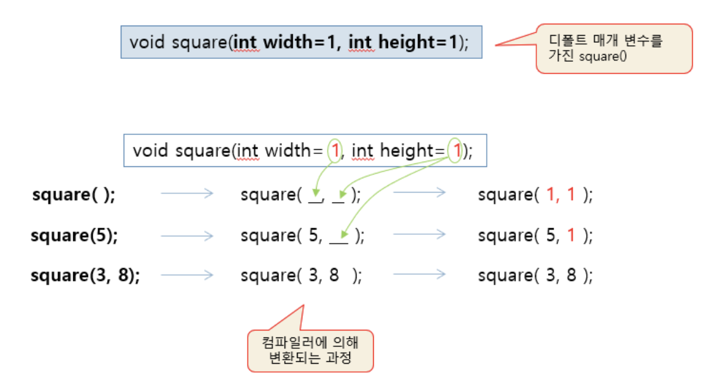
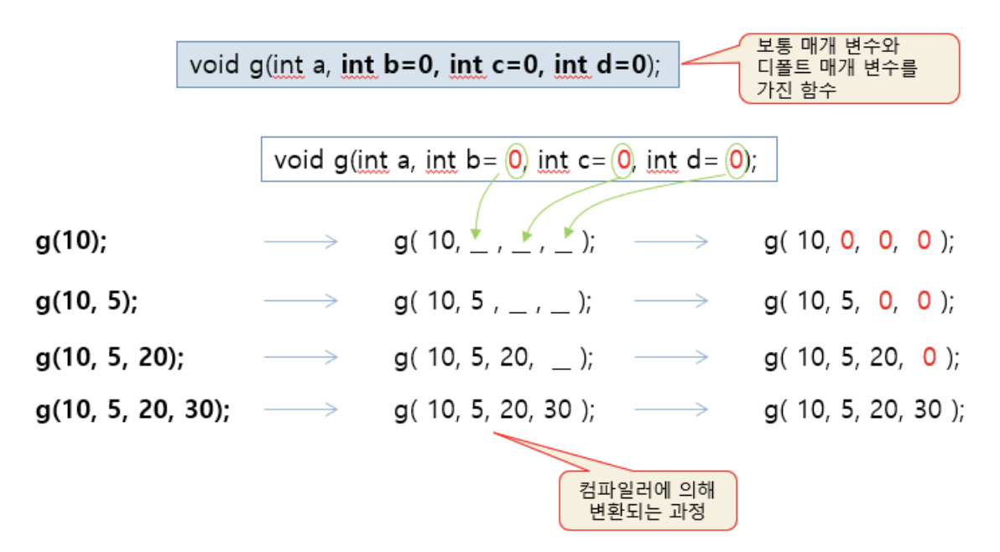

# 6.2 디폴트 매개 변수
```
default parameter

매개 변수 값이 넘어오지 않는 경우, 디폴트 값을 받도록 선언된 매개 변수
``` 

**`매개 변수 = 디폴트 값`** 형태로 선언

디폴트 매개 변수에 디폴트 값을 전달하는 것은 컴파일러에 의해 처리됨.

## 디폴트 매개 변수 선언 사례
```cpp
void star(int a = 5);   //a의 디폴트 값은 5
``` 

## 디폴트 매개 변수를 가진 함수 호출
```cpp
star();     //매개변수 a에서 디폴트 값 5가 전달됨. star(5)와 동일
star(10);   //매개변수 a에 10을 넘겨줌.
``` 

<br><br><br>

# 6.2.1 디폴트 매개 변수 사례

## 사례 1

```cpp
void msg(int id, string text = "Hello");    //text의 디폴트값은 "Hello"


msg(10);                //msg(10,"Hello"); 호출과 동일
msg(20, "Good Morning");//id에 20, text에 "Good Morning" 전달

//호출 오류
msg();          //컴파일 오류, 첫 번째 매개변수 id에 반드시 값 전달해야함
msg("Hello");   //컴파일 오류, 첫 번째 매개 변수 id에 값이 전달되지 않음
``` 

<br>
<br>

## 디폴트 매개 변수에 관한 제약 조건

디폴트 매개 변수는 보통 매개 변수 앞에 선언될 수 없음

- 디폴트 매개 변수는 끝 쪽에 몰려 선언되야함.



## 매개 변수에 값을 정하는 규칙

*디폴트 매개 변수를 가지고 있는 함수의 호출문을 컴파일 할 때, 컴파일러는 함수 호출문에 나열된 실인자 값들을 앞에서부터 순서대로 함수의 매개 변수에 전달하고 나머지는 디폴트 값으로 전달*

## 사례 2
디폴트 매개 변수만 가진 함수


순서가 중요하다. 
## 사례 3
디폴트 매개 변수와 보통 매개변수를 가진 함수



## 예제 : 디폴트 매개 변수를 가진 함수 선언 및 호출

```cpp
#include <iostream>
#include <string>
using namespace std;

// 원형 선언
void star(int a=5);
void msg(int id, string text="");

// 함수 구현
void star(int a) {
	for(int i=0; i<a; i++)
		cout << '*';
	cout << endl;
}

void msg(int id, string text) {
	cout << id << ' ' << text << endl;
}

int main() {
	// star() 호출
	star();
	star(10);

	// msg() 호출
	msg(10);
	msg(10, "Hello");
}
```
```
*****
**********
10 
10 Hello
```

## 예제 : 디폴트 예제 변수를 가진 함수 만들기
```cpp
#include <iostream>
using namespace std;

// 원형 선언
void f(char c=' ', int line=1);

// 함수 구현
void f(char c, int line) {
	for(int i=0; i<line; i++) {
		for(int j=0; j<10; j++)
			cout << c;
		cout << endl;
	}
}

int main() {
	f(); // 한줄에 빈칸을 10개 출력한다.
	f('%'); // 한 줄에 '%'를 10개 출력한다.
	f('@', 5); // 5 줄에 '@' 문자를 10개 출력한다.
}
```
```
%%%%%%%%%%
@@@@@@@@@@
@@@@@@@@@@
@@@@@@@@@@
@@@@@@@@@@
@@@@@@@@@@
```

<br><br><br>

# 6.2.2 디폴트 매개 변수 동작
```
디폴트 매개 변수는 변수에 초깃값을 지정하는 것과 유사
``` 
호출문으로부터 디폴트 매개 변수에 전달되는 값을 정하는 것은 컴파일러의 기능

## 포인터 변수의 디폴트 값

포인터 변수를 디폴트 매개 변수로 선언할 때 다음과 같이 값을 줄 수 있음

```cpp
void f(int *p = NULL);
void g(int x[] = NULL);
void h(const char *s = "Hello");
```

<br><br><br>

# 6.2.3 함수 중복 간소화

디폴트 매개 변수의 장점 : **함수 중복 간소화**

```cpp
class Circle{
public:
    Circle(){radius = 1;}
    Circle(int r){radius = 1;}
}

class Circle{
public:
    Circle(int r = 1){radius = r;}
}
//2개의 생성자 함수를 디폴트 매개 변수를 가진 하나의 함수로 간소화 ^^
``` 

중복 함수들과 디폴트 매개 변수를 가진 함수를 함께 사용 불가

```cpp
class Circle{
public:
    Circle(){radius = 1;}
    Circle(int r){radius = r;}
    Circle(int r = 1){radius = r;}  //중복된 함수와 동시 사용 불가....X
}
``` 

<br><br><br>

## 예제 : 디폴트 매개 변수를 이용하여 중복함수 간소화 연습

### 조건
다음 두 개의 중복함수를 디폴트 매개 변수를 가진 하나의 함수로 작성하라.
```cpp
void fillLine(){//25개의 *문자를 한 라인에 출력
    for(int i = 0; i < 25; i++) cout << '*';
    cout<< endl;
}

void fillLine(int n, char c){//n개의 c문자를 한 라인에 출력
    for(int i = 0;i < n ; i++) cout <<c;
    cout << endl;
}
``` 

### 코드
```cpp
#include <iostream>
using namespace std;

void fillLine(int n=25, char c='*') { // n개의 c 문자를 한 라인에 출력
	for(int i=0; i<n; i++) cout << c;
	cout << endl;
}

int main() {
	fillLine(); // 25개의 '*'를 한 라인에 출력
	fillLine(10, '%'); // 10개의 '%'를 한 라인에 출력
}
```
```
*************************
%%%%%%%%%%
```

## 예제 : 생성자 함수와 중복 간소화
```cpp
#include <iostream>
using namespace std;

class MyVector{
	int *p;
	int size;
public:
	MyVector(int n=100) { 
		p = new int [n];
		size = n;
	}
	~MyVector() { delete [] p; }
};

int main() {
	MyVector *v1, *v2;
	v1 = new MyVector(); // 디폴트로 정수 100개의 배열 동적 할당
	v2 = new MyVector(1024); // 정수 1024개의 배열 동적 할당

	delete v1;
	delete v2;
}
//출력이 아무것도 안나옴...(?)
```