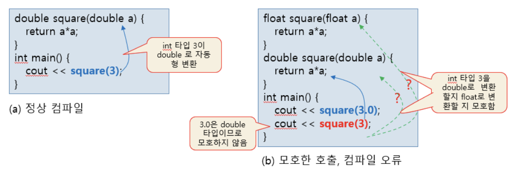

# 6.3 함수 중복의 모호성

``` 
함수 중복이 `모호(ambiguous)`하여 컴파일러가 어떤 함수를 호출하는 지 판단하지 못하는 경우의 3가지 종류
``` 
- 형 변환으로 인한 모호성

- 참조 매개 변수로 인한 모호성

- 디폴트 매개 변수로 인한 모호성

함수 호출이 모호한 경우 컴파일러는 오류를 발생시키므로 모호하지 않게 함수를 중복 작성해야한다.

배열의 이름은 포인터 이기 때문에, 다음 두 함수는 같은 함수로 공존 불가.
```cpp
void f(int a[]);
void f(int* a);
```

# 6.3.1 형 변환으로 인한 함수 중복의 모호성

> 매개 변수의 형 변환으로 인한 중복 함수 호출의 모호성

함수의 매개 변수 타입과 호출문의 실인자 타입이 **일치하지 않는 경우**, 컴파일러는 보이지 않게 `형 변환(type conversion)`을 시도.

자동 형 변환 (`char` → `int` → `long` → `float` → `double`)

컴파일러가 임의로 선택하게 되면 개발자의 의도와 달라질 수 있기 때문에 최선의 선택은 모호한 호출로 판정하여 컴파일 오류를 발생



## 예제 : 형 변환으로 인해 함수 중복이 모호한 경우
```cpp
#include <iostream>
using namespace std;

float square(float a) {
	return a*a;
}

double square(double a) {
	return a*a;
}

int main() {
	cout << square(3.0); // square(double a); 호출
	cout << square(3); // 컴파일 오류
}
```
```
Main.cpp: In function ‘int main()’:
Main.cpp:14:23: error: call of overloaded ‘square(int)’ is ambiguous
   14 |         cout << square(3); // 컴파일 오류
      |                 ~~~~~~^~~
Main.cpp:4:7: note: candidate: ‘float square(float)’
    4 | float square(float a) {
      |       ^~~~~~
Main.cpp:8:8: note: candidate: ‘double square(double)’
    8 | double square(double a) {
      |        ^~~~~~
make: *** [cmd] Error 1
```

<br><br><br>

# 6.3.2 참조 매개 변수로 인한 함수 중복의 모호성
```
중복된 함수 중에서 참조 매개 변수를 가진 함수가 있는 경우, 이들 사이에 모호성이 존재할 수 있음
``` 

```cpp
int add(int a, int b);
int add(int a, int &b);
``` 

위의 두 함수 중 어떤 함수를 호출하는 것인지 판단할 수 없어, 컴파일러는 컴파일 오류를 발생시킴

```cpp
int s = 10, t = 20;
add(s,t); //함수 호출의 모호성 -- 컴파일 오류
``` 

## 예제 : 참조 매개 변수로 인한 함수 중복의 모호성
```cpp
#include <iostream>
using namespace std;

int add(int a, int b) {
	return a + b;	
}

int add(int a, int &b) {
	b = b + a;
	return b;
}

int main(){
	int s=10, t=20;
	cout << add(s, t); // 컴파일 오류
}
```

```
 Main.cpp: In function ‘int main()’:
Main.cpp:15:20: error: call of overloaded ‘add(int&, int&)’ is ambiguous
   15 |         cout << add(s, t); // 컴파일 오류
      |                 ~~~^~~~~~
Main.cpp:4:5: note: candidate: ‘int add(int, int)’
    4 | int add(int a, int b) {
      |     ^~~
Main.cpp:8:5: note: candidate: ‘int add(int, int&)’
    8 | int add(int a, int &b) {
      |     ^~~
make: *** [cmd] Error 1
```

<br><br><br>

# 6.3.3 디폴트 매개 변수로 인한 함수 중복의 모호성

``` 
디폴트 매개 변수를 가진 함수가 보통 매개 변수를 가진 함수와 중복 작성될 때, 이들 사이에 모호성이 존재할 수 있음
``` 
```cpp
void msg(int id);
void msg(int id, string s="");
```

아래의 함수 호출은 위의 중복된 두 `msg()`함수 중 어떤 함수를 호출해도 무관하므로, 컴파일 오류 발생

```cpp
msg(6); //함수 호출 모호, 컴파일 오류
``` 

# 예제 : 디폴트 매개 변수로 인한 함수 중복의 모호성
```cpp
#include <iostream>
#include <string>
using namespace std;

void msg(int id) {
	cout << id << endl;
}

void msg(int id, string s="") {
	cout << id << ":" << s << endl;
}

int main(){
	msg(5, "Good Morning"); // 정상 컴파일. 두 번째 msg() 호출
	msg(6); // 함수 호출 모호. 컴파일 오류
}
```
```
Main.cpp: In function ‘int main()’:
Main.cpp:15:12: error: call of overloaded ‘msg(int)’ is ambiguous
   15 |         msg(6); // 함수 호출 모호. 컴파일 오류
      |         ~~~^~~
Main.cpp:5:6: note: candidate: ‘void msg(int)’
    5 | void msg(int id) {
      |      ^~~
Main.cpp:9:6: note: candidate: ‘void msg(int, std::string)’
    9 | void msg(int id, string s="") {
      |      ^~~
make: *** [cmd] Error 1
```