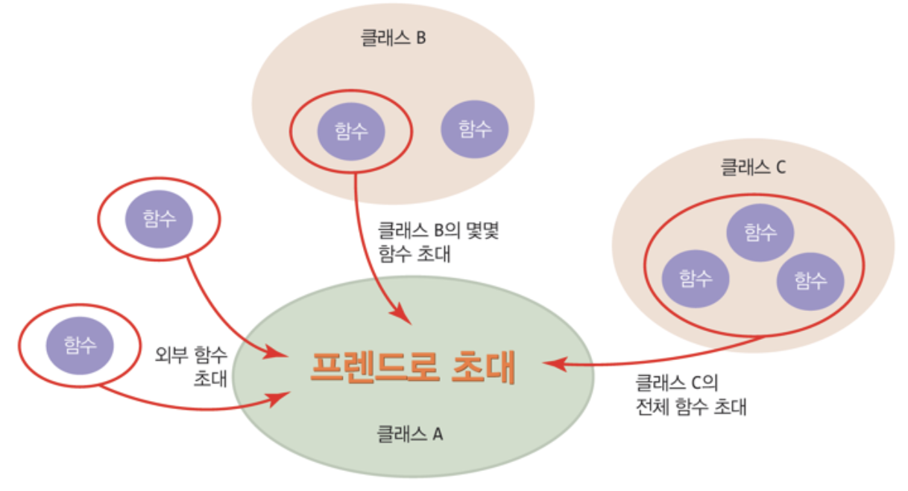

# 7.1 C++ 프렌드 개념


# 7.1.1 C++ 프렌드

## 프렌드 함수 

### 클래스의 맴버 함수가 아닌 외부 함수

- 전역 함수
- 다른 클래스의 맴버 함수

### friend 키워드로 클래스 내에 선언된 함수

- 클래스의 모든 맴버를 접근할 수 있는 권한 부여
- 프렌드 함수라고 부름

### 프렌드 선언의 필요성 

클래스 맴버 함수로 선언하기에는 무리가 있고, 클래스의 모든 맴버를 자유롭게 접근할 수 있는 일부 외부 함수 작성 시에 필요하다.

항목 | 세상의 친구 | 프렌드 함수
--|--|--
존재 | 가족 아님. 외부인 | 클래스 외부에 작성된 함수, 맴버가 아님
자격 | 가족의 구성원으로 인정. 가족의 모든 살림살이에 접근 허용 | 클래스 맴버 자격 부여. 클래스의 모든 맴버에 대해 접근 가능
선언 | 친구라고 소개 | 클래스 내에 friend 키워드로 선언
개수 | 친구의 명수에 제한 없음 | 프렌드 함수 개수에 제한 없음

<br />
<br />

## 프렌드로 초대하는 3 가지 유형

전역 함수 : 클래스 **외부**에 선언된 전역 함수

다른 클래스의 맴버 함수 : 다른 클래스의 특정 맴버 함수 

다른 클래스 전체 : 다른 클래스의 모든 맴버 함수



<br />
<br />

## 프렌드 선언 3 종류

### 1. 외부 함수 `equals()`를 `Rect`클래스에 프렌드로 선언

```cpp
class Rect{
    friend bool equals(Rect r, Rect s);
};
```
함수 `equals()`를 프렌드 함수로 선언

### 2. `RectManager` 클래스의 `equals()`맴버 함수를 `Rect`클래스에 프렌드로 선언

```cpp
class Rect{
    friend bool RectManager::equals(Rect r, Rect s);
};
```
`RectManager`의 `equals()` 맴버 함수를 프렌드로 초대

### 3. `RectManager` 클래스의 모든 맴버 함수를 Rect`클래스에 프렌드로 선언
```cpp
class Rect{
    friend RectManager;
};
```
`RectManager` 클래스의 모든 함수를 프렌드로 초대 
